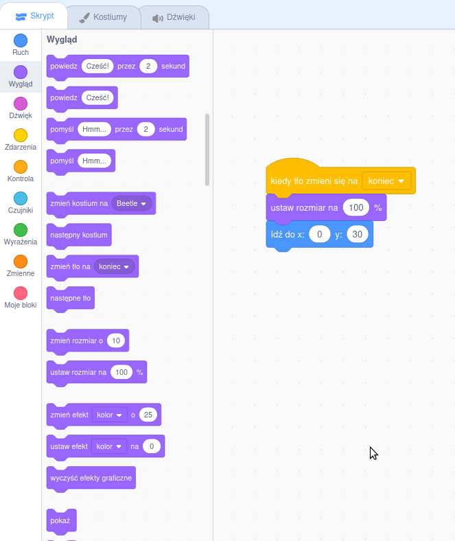

## Ekran końcowy

<div style="display: flex; flex-wrap: wrap">
<div style="flex-basis: 200px; flex-grow: 1; margin-right: 15px;">
Stworzysz ekran "koniec", który pokaże liczbę sekund, jakich potrzebował gracz aby znaleźć robaki. 
</div>
<div>

{:width="300px"}

</div>
</div>

<p style="border-left: solid; border-width:10px; border-color: #0faeb0; background-color: aliceblue; padding: 10px;">
Czasami samo przejście gry nie wystarczy. Gracze lubią wiedzieć, jak poradzili sobie przeciwko innym graczom lub sobie. Czy możesz pomyśleć o grze, która pokaże ci, jak dobrze sobie poradziłeś?</p>

--- task ---

Dodaj tło **Chalkboard** z kategorii **W pomieszczeniu**.


**Wskazówka:** W Scratch możesz dodać to samo tło więcej niż raz.

--- /task ---

--- task ---

Kliknij na zakładkę **Tła**, aby otworzyć edytor Paint.


--- /task ---

--- task ---

Zmień nazwę tła na `koniec`:


**Wskazówka:** Zmiana nazwy tła na **koniec** ułatwia zrozumienie kodu.

--- /task ---

--- task ---

Kliknij duszka **bug** i dodaj kod, aby umieścić robaka na ekranie "koniec":


```blocks3
when backdrop switches to [koniec v]
set size to [100] % // pełnowymiarowy
go to x: [0] y: [30] // na tablicy
```

--- /task ---

Jak długo zajmuje Tobie znalezienie i kliknięcie robaków? Scratch ma `stoper`{:class="block3sensing"}, którego możesz użyć, aby się dowiedzieć.

--- task ---

Blok `stoper`{:class="block3sensing"} znajduje się w menu bloków `Czujniki`{:class="block3sensing"}. Dodaj kod, aby robak `mówił`{:class="block3looks"} `stoper`{:class="block3sensing"} na ekranie "koniec":


```blocks3
when backdrop switches to [koniec v]
set size to [100] % // pełnowymiarowy
go to x: [0] y: [30] // na tablicy
+say (timer) // sekundy, które upłynęły
```



--- /task ---

--- task ---

**Test:** Kliknij zieloną flagę, aby przetestować swoje umiejętności szukania. Jak długo zajmuje Tobie znalezienie robaka?

--- /task ---

Aby wrócić do ekranu "start", kliknij robaka na ekranie "koniec".

--- task ---

Dodaj kod, aby robak przestał mówić `stoper`{:class="block3sensing"} po przejściu do ekranu "start":


```blocks3
when backdrop switches to [start v]
set size to [100] % // pełnowymiarowy
go to x: [0] y: [30] // na tablicy
+say [] // nie mów nic
```

--- /task ---

Jeśli zagrasz w grę po raz drugi, `stoper`{:class="block3sensing"} będzie nadal liczył.

--- task ---

Dodaj kod `resetuj stoper`{:class="block3sensing"}, `kiedy tło zmieni się na`{:class="block3events"} pierwszy poziom:


```blocks3
when backdrop switches to [Spotlight v] // pierwszy poziom
set size to [20] % // malutki
go to x: [13] y: [132] // na kuli dyskotekowej
+reset timer // uruchom stoper
```

--- /task ---

--- task ---

**Test:** Kliknij zieloną flagę i rozpocznij grę. Stoper powinien się zresetować po kliknięciu robaka na ekranie "start" przy przejściu do pierwszego poziomu. Kiedy klikniesz robaka na ekranie "koniec", powinieneś wrócić do ekranu "start" i zobaczyć, że robak nie mówi `stoper`{:class="block3sensing"}.

--- /task ---

--- save ---
