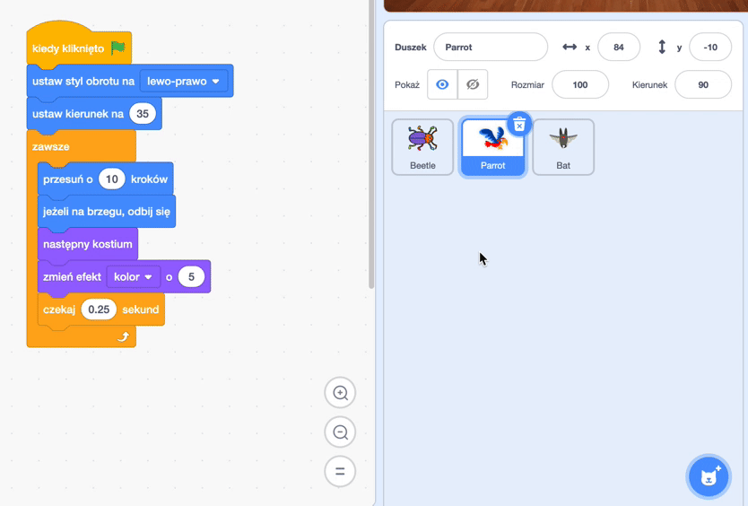

## Ulepsz swoją grę

Jeśli masz czas, możesz dodać więcej poziomów i więcej rozpraszaczy do swojej gry. Możesz także zmienić ukrywającego się duszka oraz zmienić tekst napisany na tablicy.

--- task ---

Zagraj w swoją grę i zobacz, jak szybko możesz znaleźć robaki.

Czy masz w pobliżu osoby, które mogłoby wypróbować Twoją grę? Jak szybko będą w stanie znaleźć robaki? Nie będą wiedzieć, gdzie są schowane, więc może im to zająć trochę więcej czasu!

Czy jest coś, co chcesz zmienić?

Możesz:
- Sprawić, aby papuga była jeszcze bardziej irytująca
- Zmniejszyć robaki
- Zmienić `efekt koloru`{:class="block3looks"}, aby zakamuflować robaka na każdym poziomie
- Zmienić czcionkę lub kolor tekstu

--- /task ---

### Dodaj więcej poziomów

--- task ---

Oto bloki, których będziesz potrzebować, aby ukryć robaka na nowym poziomie:

```blocks3
when backdrop switches to [nowy poziom v]

set size to [20] %

go to x: [0] y: [0] // najpierw umieść robaka w kryjówce

set [color v] effect to [50]
```

Dla każdego poziomu musisz:
- Dodać tło
- Kliknąć na panel Sceny, potem zakładkę **Tła**, a następnie przeciągnąć nowe tło na miejsce przed tłem **koniec**
- Dodać blok `kiedy tło zmieni się na`{:class="block3events"} dla nowego tła oraz dodać kod, aby umieścić i ukryć robaka

**Wskazówka:** Aby przeciągnąć robaka do nowej kryjówki, należy „złamać” kod, aby tło nie zmieniło się po kliknięciu robaka.

--- /task ---

### Dodaj więcej elementów rozpraszających uwagę

--- task ---

Możesz dodać więcej papug lub wybrać innego duszka, który będzie odwracał uwagę.

Oto kod, którego użyliśmy dla papugi:

```blocks3
when flag clicked
set rotation style [lewo-prawo v] // nie idź do góry nogami
point in direction [35] // liczba od -180 do 180
forever // nie przestawaj być denerwujący
move [10] steps // liczba kontroluje prędkość
if on edge, bounce // pozostań na Scenie
next costume // machaj skrzydłami
change [color v] effect by [5] // wypróbuj 11 albo 50
wait [0.25] seconds // wypróbuj 0.1 albo 0.5
end
```

**Wskazówka:** Możesz przeciągnąć kod duszka **Parrot** na innego duszka, aby przyspieszyć tworzenie kolejnego duszka rozpraszającego.



--- /task ---

--- collapse ---
---
title: Ukończony projekt
---

Tutaj możesz zobaczyć [ukończony projekt](https://scratch.mit.edu/projects/918096080/){:target="_blank"}.

--- /collapse ---