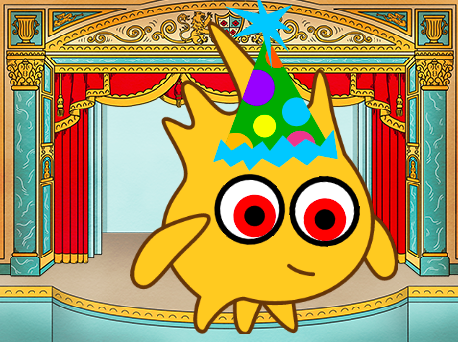

## E agora?

Se você está seguindo o caminho de [Introdução ao Scratch](https://projects.raspberrypi.org/en/pathways/scratch-intro), você pode continuar para o projeto [Olhos tolos](https://projects.raspberrypi.org/en/projects/silly-eyes). Neste projeto, você irá desenhar a sua própria personagem com olhos que apontam para onde você mover o seu rato!

--- print-only ---

--- /print-only ---

--- no-print ---

  <iframe allowtransparency="true" width="485" height="402" src="https://scratch.mit.edu/projects/embed/495141114/?autostart=false" frameborder="0"></iframe>

--- /no-print ---
