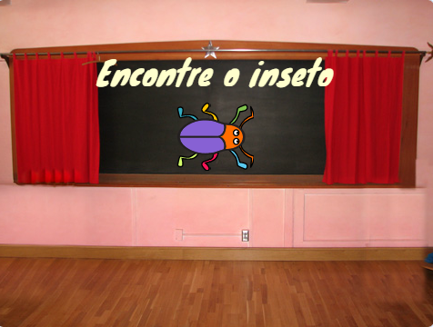
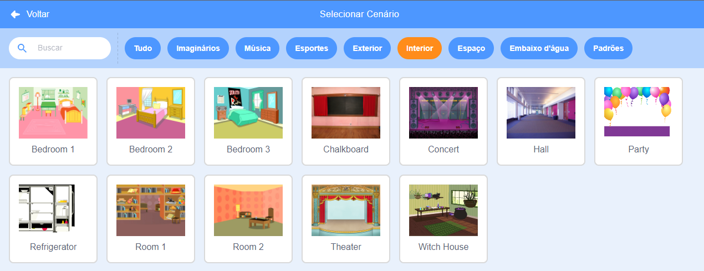
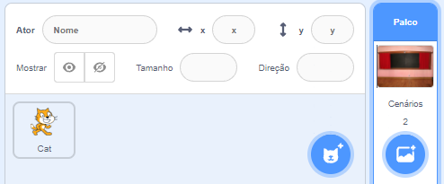
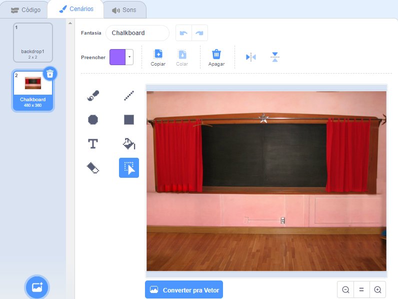
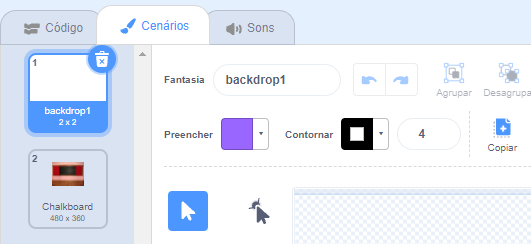
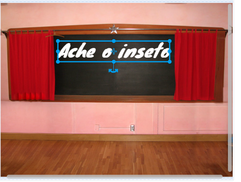
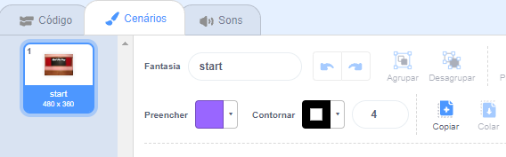
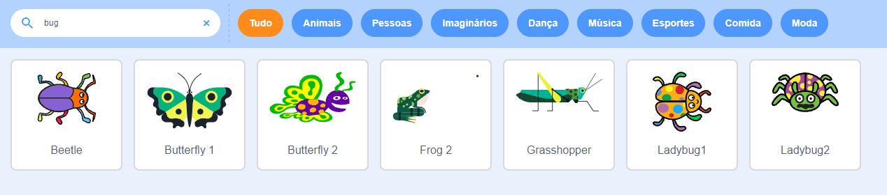

## Tela inicial

O seu jogo vai começar com uma tela de 'inicial', e os jogadores irão clicar no inseto para ir para o primeiro nível.

{:width="300px"}

--- task ---

Abra o [projeto inicial Encontre o inseto](https://scratch.mit.edu/projects/582214723/editor){:target="_blank"}. O Scratch será aberto em outra aba do navegador.

[[[working-offline]]]

--- /task ---

--- task ---

Adicione o plano de fundo **Chalkbord** (Quadro-negro) da categoria de **Interior**.

--- /task ---

O **Palco** tem um botão de **Cenários** em vez de um botão de **Fantasias**. É aqui que você consegue criar imagens para o **Palco**.

--- task ---

Clique no painel do Palco.

--- /task ---

--- task ---

Clique na aba **Cenários** para abrir o editor Paint.

--- /task ---

--- task ---

Selecione **backdrop1** e clique no ícone **Excluir** para remover o cenário **backdrop1** de seu projeto. Você não vai precisar do cenário **backdrop1** neste projeto.

--- /task ---

O cenário **Chalkboard** (Quadro negro) será destacado.

--- task ---

Clique em **Converter para Vetor**. Agora, você poderá adicionar texto que você poderá mover para onde quiser.

--- /task ---

--- task ---

Use a ferramenta **Texto** para adicionar o texto `Encontre o inseto` no quadro-negro:

Usamos **Marker** branco, mas você pode **escolher** a fonte e a cor que quiser.

**Dica:** Mude para a ferramenta **Selecionar** para mover o texto. Para alterar o tamanho do texto, segure o canto da caixa de texto e arraste-a.

--- /task ---

--- task ---

Altere o nome do cenário para `inicial`, porque você precisará selecioná-lo mais tarde no projeto.

**Dica:** Se você usar nomes que realmente tenham significado, será mais fácil entender seu projeto, especialmente quando você voltar a um projeto mais tarde.

--- /task ---

--- task ---

Exclua o ator **Gato Scratch**.

--- /task ---

--- task ---

Clique em **Selecione um Ator** e digite `bug` (inseto) na caixa de pesquisa.

**Escolha:** Escolha um inseto, os jogadores precisarão encontrar esse inseto no jogo.

**Dica:** Dê um nome ao seu projeto. Você pode querer incluir o nome do inseto que acabou de escolher.

--- /task ---

Um erro em um programa de computador é chamado de **bug**. Encontrar e remover erros em programas de computador é chamado de **debugging**. Grace Hopper é uma famosa engenheira de software. Certa vez, sua equipe encontrou uma mariposa em seu computador. Suas anotações dizem: "Primeiro caso real de bug (inseto em inglês) sendo encontrado."

--- save ---

