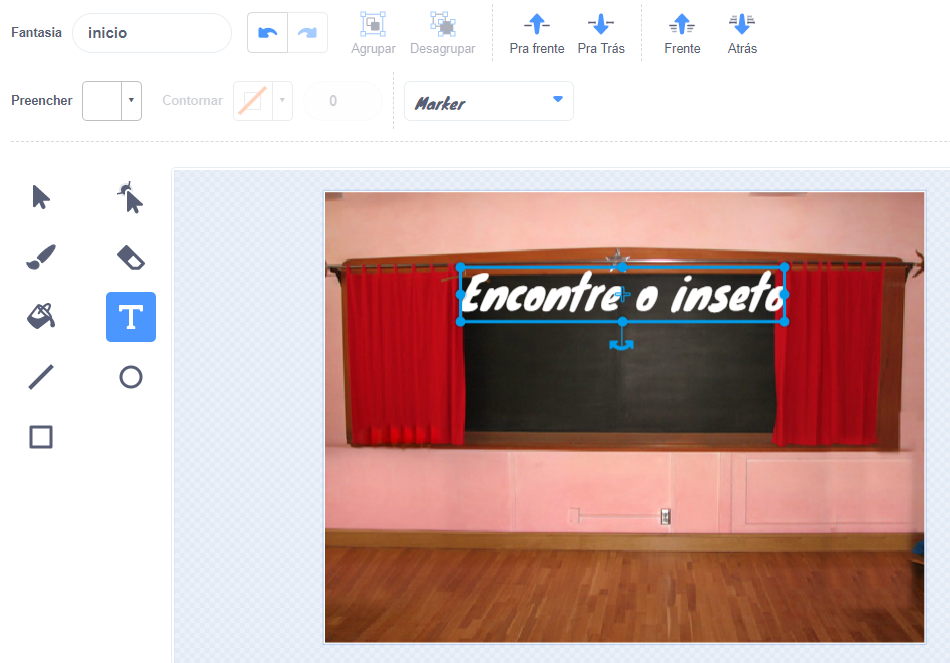
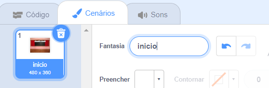

## Tela inicial

O seu jogo vai começar com uma tela de 'início', e os jogadores irão clicar no inseto para ir para o primeiro nível.

{:width="300px"}

--- task ---

Abra o [projeto inicial Encontre o inseto](https://scratch.mit.edu/projects/582214723/editor){:target="_ blank"}. O Scratch será aberto em outra aba do navegador.

[[[working-offline]]]

--- /task ---

--- task ---

Adicione o plano de fundo **Quadro-negro** da categoria de **Interiores**.

--- /task ---

O **Palco** tem um botão de **Plano de fundo** em vez de um botão de **Costumes**. É aqui que você consegue criar imagens para o **Palco**.

--- task ---

Clique no painel do Palco.

--- /task ---

--- task ---

Clique na aba **Cenários** para abrir o editor Paint.

--- /task ---

--- task ---

Selecione **cenário1** e clique no ícone**Excluir** para remover o **cenário1** de seu projeto. Você não vai precisar do **cenário1** neste projeto.

--- /task ---

O cenário **Quadro negro** será destacado.

--- task ---

Clique em **Converter para Vetor**. Agora, você poderá adicionar texto que você poderá mover para onde quiser.

--- /task ---

--- task ---

Use a ferramenta **Texto** para adicionar o texto `Encontre o Inseto` no quadro-negro:

Usamos **Marcador** branco, mas você pode **escolher** a fonte e a cor que quiser.

**Dica:** Mude para a ferramenta **Selecione (Seta)** para mover o texto. Para alterar o tamanho do texto, segure o canto da caixa de texto e arraste-a.

--- /task ---

--- task ---

Altere o nome do cenário para `início`, porque você precisará selecioná-lo mais tarde no projeto.

**Dica:** Se você usar nomes que realmente tenham significado, será mais fácil entender seu projeto, especialmente quando você voltar a um projeto mais tarde.

--- /task ---

--- task ---

Exclua o ator**Gato Scratch**.

--- /task ---

--- task ---

Clique em **Escolher um Ator** e digite `Inseto` na caixa de pesquisa.

**Escolha:** Escolha um inseto, os jogadores precisarão encontrar esse inseto no jogo.

**Dica:** Dê um nome ao seu projeto. Você pode querer incluir o nome do inseto que acabou de escolher.

--- /task ---

Um erro em um programa de computador é chamado de **bug**. Encontrar e remover erros em programas de computador é chamado de **debugging**. Grace Hopper é uma famosa engenheira de software. Certa vez, sua equipe encontrou uma mariposa em seu computador. Suas anotações dizem: "Primeiro caso real de bug (inseto em inglês) sendo encontrado."

--- save ---

