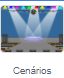
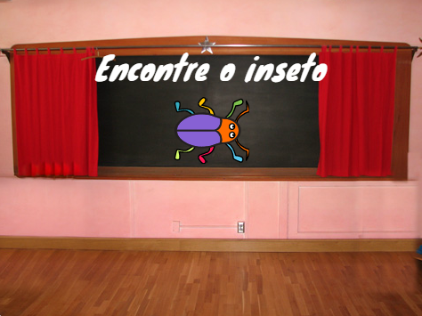

## Primeiro nível

<div style="display: flex; flex-wrap: wrap">
<div style="flex-basis: 200px; flex-grow: 1; margin-right: 15px;">
Você vai adicionar um novo cenário como o nível 1 do jogo e vai esconder o inseto.
</div>
<div>

! [O cenário Holofote com um inseto.] (images/first-level.png) {:width="300px"}

</div>
</div>

### Adicione outro plano de fundo

--- task ---

Adicione o cenário**Holofote** da categoria de **Música**.


--- /task ---

### Redimensione o inseto

--- task ---

Clique no ator**inseto** na lista de Atores. Adicione um ator para alterar o `tamanho`{:class="block3looks"} do inseto `quando o cenário for alterado para Holofote`{:class="block3events"}:


```blocks3
when backdrop switches to [Spotlight v]
set size to [20] % // tiny
```

--- /task ---

--- task ---

Clique no código para alterar o tamanho e arraste seu minúsculo inseto para um esconderijo.

Adicione o código para posicionar o inseto:


```blocks3
when backdrop switches to [Spotlight v]
set size to [20] % // tiny
+ go to x: [13] y: [132] // on the disco ball
```

**Escolha:** Você pode escolher um tamanho e um lugar diferente, se quiser.

--- /task ---

### Mover para o próximo cenário

Quando você executa o jogo e encontra o inseto, o jogo vai para o próximo cenário. Além disso, para começar o jogo, você vai clicar no inseto na tela 'iniciar'.

O próximo `bloco cenário`{:classe="block3looks"} altera o plano de fundo para o próximo cenário na ordem da lista de cenários na aba **Cenários** para o **Palco**.

--- task ---

Adicione um script ao ator**inseto** para `tocar um som Pop`{:class="block3sound"} e mudar para o `próximo cenário`{:class="block3looks"} `quando o ator for clicado`{:class="block3events"}:


```blocks3
when this sprite clicked
play sound [Pop v] until done
next backdrop
```

--- /task ---

### Faça o jogo começar com a tela inicial

--- task ---

Clique no painel Palco e adicione o seguinte código ao **Palco**:



```blocks3
when flag clicked
switch backdrop to [start v] // 'start' screen
```

--- /task ---

--- task ---

**Teste:** Clique na bandeira verde e teste o seu projeto.

Você vai notar que na tela 'inicio', o inseto ainda vai ter as mesmas preferências para se esconder mesmo lugar desde o primeiro nível (neste exemplo, no globo de discoteca).

**Dica:** Após o último cenário da lista, `próximo cenário`{:class="block3looks"} será alterado novamente para o primeiro cenário.

--- /task ---

--- task ---

Clique no ator **inseto** na lista de Atores. Adicione um script ao `definir tamanho`{:class="block3looks"} do inseto quando o `cenário for alterado para`{:class="block3events"} a tela `inicio`{:class="block3events"}:


```blocks3
when backdrop switches to [start v]
set size to [100] % // full-sized
```

--- /task ---

### Mude a posição do inseto

--- task ---

Tente posicionar o inseto na tela 'inicio'.

Seu código fará a mudança de cenário quando você clicar no inseto! Isso não é tão útil quando você está tentando posicionar o inseto.

Para consertar o problema, você precisa interromper a execução do código por clicar no inseto.

--- /task ---

--- task ---

Clique na bandeira verde para retornar à tela 'inicio'.

Clique sobre o ator **inseto** na lista de Atores e arraste os blocos para longe do bloco `quando este ator for clicado`{:class="block3events"}:


--- /task ---

--- task ---

Tente posicionar o inseto novamente. Arraste o inseto para o quadro-negro, por baixo do texto:



Adicione código para assegurar que o inseto está posicionado no quadro-negro toda vez que o `cenário for alterado para`{:class="block3events"} a tela `inicio`{:class="block3events"}:


```blocks3
when backdrop switches to [start v]
set size to [100] % // full-sized
+ go to x: [0] y: [30] // on the board
```

--- /task ---

--- task ---

Junte os blocos novamente de forma que os blocos estejam debaixo do bloco `quando este ator for clicado`{:class="block3events"}:


--- /task ---

--- task ---

**Teste:** Clique na bandeira verde e teste o seu projeto. Clique no inseto para avançar para o próximo cenário. O inseto deve estar grande na tela 'inicio' e pequeno no nível 'Spotlight' (Holofote).

--- collapse ---
---
title: Nada acontece quando eu clico no bug
---

Você esqueceu de juntar o código no bloco `quando este ator for clicado`{:class="block3events"}?

--- /collapse ---

--- /task ---