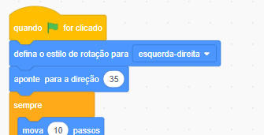

## A distração do papagaio

<div style="display: flex; flex-wrap: wrap">
<div style="flex-basis: 200px; flex-grow: 1; margin-right: 15px;">
Para dificultar para os jogadores encontrarem e clicarem no inseto, você vai colocar um papagaio irritante para distraí-los. 
</div>
<div>

{:width="300px"}

</div>
</div>

### Adicione o sprite Papagaio

--- task ---

Adicione o ator**Parrot**.


--- /task ---

### Animar o sprite Papagaio

No projeto [Pegue o ônibus](https://projects.raspberrypi.org/en/projects/catch-the-bus){: target = "_ blank"}, você usou um loop`repetir`{:class ="block3control"}.

Você usará um loop diferente aqui. Um loop `infinito`{:class="block3control"} executa os blocos de código dentro dele de forma contínua, sem interrupção. É o loop perfeito para um papagaio chato que não para de voar e fica no caminho.

--- task ---

Adicione código para fazer o papagaio bater as asas de uma forma distrativa: Look at the comments on the code blocks for some different numbers to try:


```blocks3
when flag clicked
set rotation style [left-right v] // do not go upside down
point in direction [35] // number from -180 to 180
forever // keep being annoying
move [10] steps // the number controls the speed
if on edge, bounce // stay on the Stage
next costume // flap
change [color v] effect by [5] // try 11 or 50
wait [0.25] seconds // try 0.1 or 0.5
end
```

--- /task ---

--- task ---

**Teste:** Clique na bandeira verde e teste o seu projeto novamente. Você consegue se lembrar onde escondeu o inseto?

No Scratch, o código em execução é destacado com um contorno amarelo:



**Dica:** Se o papagaio te chatear demais enquanto você está escrevendo seu código, você pode clicar no botão vermelho "parar" acima do Palco para interromper a execução do código.

--- /task ---

