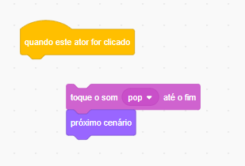
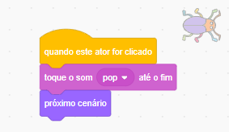

## Nível 2

<div style="display: flex; flex-wrap: wrap">
<div style="flex-basis: 200px; flex-grow: 1; margin-right: 15px;">
Você escolherá um cenário para criar um segundo nível para o jogo e dificultar a localização do inseto. 
</div>
<div>

{:width="300px"}

</div>
</div>

--- task ---

**Escolha:** Escolha um cenário para o nível 2. Escolhemos o cenário **Urban**, mas você pode escolher o que quiser.


**Dica:** Lembre-se de que cenários com muitas cores e detalhes irão dificultar a localização do inseto. O quão difícil você vai tornar o seu jogo?

--- /task ---

Para ser capaz de arrastar seu inseto para uma nova posição, você precisa parar a execução do script `quando este ator for clicado`{:class="block3events"}.

--- task ---

Arraste os blocos para longe do bloco `quando este ator for clicado`{:class="block3events"} para impedi-los de executarem quando você clicar no inseto:



--- /task ---

O inseto precisa ser difícil de encontrar quando o cenário for alterado. Você pode redimensionar o inseto para torná-lo mais difícil de encontrar.

--- task ---

Adicione o código `definir tamanho`{:class="block3looks"} do inseto no segundo nível:


```blocks3
when backdrop switches to [Urban v] // escolha o seu cenário
set size to [20] % // tente outro tamanho 
```

**Teste:** Clique em seu novo script para executá-lo.

--- /task ---

--- task ---

Arraste seu inseto para o Palco e o esconda bem.


--- /task ---

Posicione o inseto no esconderijo.

--- task ---

Adicione um bloco `vá para x: y:`{:class="block3motion"}:


```blocks3
when backdrop switches to [Urban v]
set size to [20] % // tente outro tamanho 
+ go to x: [24] y: [13] // na vitrine
```

--- /task ---

--- task ---

Junte os blocos ao bloco `quando este ator for clicado`{:class="block3events"} para que, quando o inseto for clicado, o cenário mude para o `próximo cenário`{:class="block3looks"}:



--- /task ---

--- task ---

**Teste:** Clique na bandeira verde e teste o seu projeto.

--- /task ---

Seu inseto agora pode estar na frente do papagaio.

--- task ---

Adicione um script para assegurar que o inseto fique sempre na posição `por trás`{:class="block3looks"}:


```blocks3
when flag clicked
forever
go to [back v] layer
```

Agora, o inseto sempre vai ficar por atrás, mesmo que você precise alterar sua posição.

--- /task ---

--- save ---
