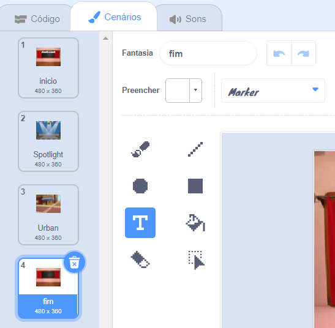
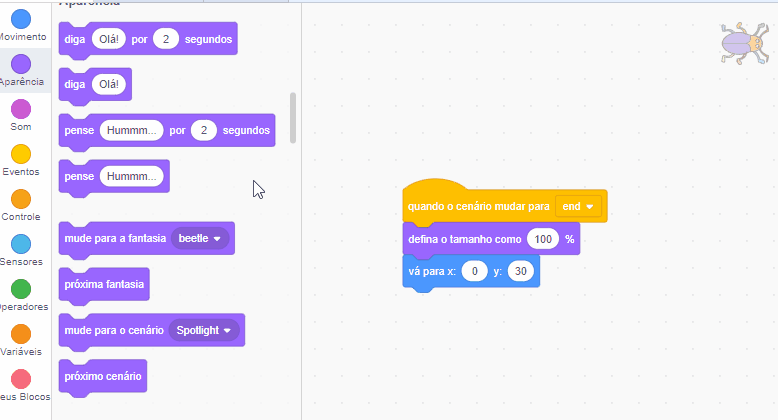

## Tela final

<div style="display: flex; flex-wrap: wrap">
<div style="flex-basis: 200px; flex-grow: 1; margin-right: 15px;">
Você criará uma tela 'final' para mostrar o número de segundos que o jogador levou para encontrar os insetos. 
</div>
<div>

! [O inseto com a quantidade de segundo em balão.] (Images/end-screen.png) {:width="300px"}

</div>
</div>

<p style="border-left: solid; border-width:10px; border-color: #0faeb0; background-color: aliceblue; padding: 10px;">
Às vezes, apenas vencer um jogo não é suficiente. Os jogadores gostam de saber como se saíram contra outros jogadores ou contra eles próprios. Você consegue pensar em um jogo que mostra quão bem você se saiu?</p>

### Adicione outro cenário

--- task ---

Adicione o cenário **Quadro-negro** da categoria de **Interiores**.


**Dica:** No Scratch, você pode adicionar o mesmo cenário mais de uma vez.

--- /task ---

### Edite o plano de fundo

--- task ---

Clique na aba **Cenários** para abrir o editor Paint.


--- /task ---

--- task ---

Altere o nome do cenário para `fim`:



**Dica:** Você nomeia o cenário com o nome de **fim** para facilitar a compreensão do seu código.

--- /task ---

### Posicione o inseto

--- task ---

Clique no **inseto** e adicione código para posicionar o inseto na tela 'final':


```blocks3
when backdrop switches to [end v]
set size to [100] % // full-sized
go to x: [0] y: [30] // on the board
```

--- /task ---

### Adicione um cronômetro

Quanto tempo você leva para localizar e clicar nos insetos? Scratch tem um `temporizador`{:class="block3sensing"} que você pode usar para descobrir.

--- task ---

O bloco `temporizador`{:class="block3motion"} está na categoria `Detecção` no menu. Adicione código para fazer o inseto`falar`{:class="block3looks"} o `temporizador`{:class="block3sensing"} na tela 'final':


```blocks3
when backdrop switches to [end v]
set size to [100] % // full-sized
go to x: [0] y: [30] // on the board
+say (timer) // seconds taken
```



--- /task ---

--- task ---

**Teste:** Clique na bandeira verde e teste suas habilidades de localização. Quanto tempo você leva achar o inseto?

--- /task ---

Para voltar à tela 'inicial', clique no inseto na tela 'final'.

--- task ---

Adicione código para fazer o inseto parar de falar`temporizador`{:class="block3sensing"} quando você tiver que ir para a tela 'iniciar':


```blocks3
when backdrop switches to [start v]
set size to [100] % // full-sized
go to x: [0] y: [30] // on the board
+say [] // say nothing
```

--- /task ---

### Pare o cronômetro

Se você jogar o jogo uma segunda vez, o `temporizador`{:class="block3sensing"} continuará contando.

--- task ---

Adicione código para `zerar o cronômetro`{:class="block3sensing"} quando o `cenário mudar para`{:class="block3events"} o primeiro nível:


```blocks3
when backdrop switches to [Spotlight v] // first level
set size to [20] % // tiny
go to x: [13] y: [132] // on the disco ball
+reset timer // start the timer
```

--- /task ---

--- task ---

**Teste:** Clique na bandeira verde e comece jogar. O cronômetro deve zerar quando você clicar no inseto na tela 'iniciar' para passar para o primeiro nível. Quando você clicar no inseto na tela 'final', você deve retornar à tela 'inicial' e verificar que o inseto não está dizendo `temporizador`{:class="block3sensing"}.

--- /task ---

