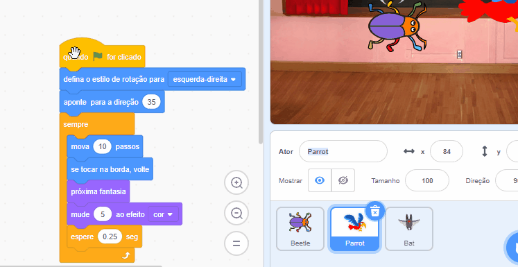

## Melhore o seu jogo

Se tiver tempo, você pode adicionar mais níveis e mais distrações ao seu jogo. Você também pode alterar a figura que está oculta e alterar o texto no quadro-negro.

--- task ---

Jogue o seu jogo e veja o quão rápido você consegue encontrar os insetos.

Há mais alguém que possa experimentar o seu jogo? Com que rapidez eles conseguem encontrar os insetos? Eles não vão saber onde você os escondeu, então podem demorar um pouco mais!

Há alguma coisa que você queira mudar?

Você poderia:
- Fazer o papagaio ainda mais irritante
- Fazer os insetos menores
- Alterar o `efeito de cor `{:class="block3looks"} para camuflar o inseto em cada nível
- Alterar a fonte ou cor do texto

--- /task ---

### Adicionar mais níveis

--- task ---

Aqui estão os blocos que você precisa para esconder o inseto em um novo nível:

```blocks3
when backdrop switches to [new level v]

set size to [20] %

go to x: [0] y: [0] // drag to position the bug first

set [color v] effect to [50]
```

Para cada nível, você precisará:
- Adicionar um cenário
- Clicar no painel Palco, depois na aba **Cenários** e arraste o novo cenário para a posição antes do cenário **fim**
- Adicionar um bloco `quando o cenário mudar para`{:class="block3events"} para o novo cenário e adicionar código para posicionar e esconder o inseto

**Dica:** Para arrastar o inseto para um novo esconderijo, você precisar 'quebrar' o código para que cenário não mude quando você clicar no inseto para posicioná-lo para um novo nível.

--- /task ---

### Adicione mais distrações

--- task ---

Você pode adicionar mais papagaios ou escolher outro sprite para servir de distração.

Aqui está o código que você usou para o papagaio:

```blocks3
when flag clicked
set rotation style [left-right v] // do not go upside down
point in direction [35] // number from -180 to 180
forever // keep being annoying
move [10] steps // the number controls the speed
if on edge, bounce // stay on the Stage
next costume // flap
change [color v] effect by [5] // try 11 or 50
wait [0.25] seconds // try 0.1 or 0.5
end
```

**Dica:** Você pode arrastar o código do sprite **Papagaiot** para outro sprite para tornar mais rápido a criação de outro sprite de distração.



--- /task ---

--- collapse ---
---
título: Projeto concluído
---

Você pode ver o projeto [concluído aqui](https://scratch.mit.edu/projects/486719939/){:target="_blank"}.

--- /collapse ---