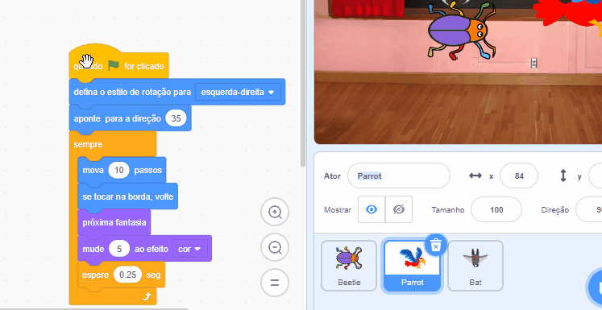

## Melhore o seu jogo

Se tiver tempo, você pode adicionar mais níveis e mais distrações ao seu jogo. Você também pode alterar o ator que está escondido e mudar o texto no quadro-negro.

Aqui estão os blocos que você precisa para esconder o inseto em um novo nível:

```blocks3
when backdrop switches to [novo nível v]

set size to [20] %

go to x: [0] y: [0] // arraste para posicionar o primeiro inseto

set [color v] effect to [50]
```

--- task ---

Para cada nível, você irá precisar de:
- Adicionar um plano de fundo
- Clique no painel Palco, depois na aba **Cenários** e arraste o novo cenário para a posição anterior ao cenários **fim**
- Adicione um bloco `quando o cenário mudar para`{:class="block3events"} para um novo cenário e adicione código para posicionar e ocultar o inseto

**Dica:** Para arrastar o inseto para um novo esconderijo, você precisar 'quebrar' o código para que cenário não mude quando você clicar no inseto para posicioná-lo para um novo nível.

--- /task ---

--- task ---

Você pode colocar mais papagaios ou escolher outro ator para servir como uma distração.

Aqui está o código que você usou para o papagaio:
```blocks3
when flag clicked
set rotation style [left-right v] // não vá ao contrário
point in direction [35] // número entre -180 e 180
forever // continua sendo irritante
move [10] steps // o número controla a velocidade
if on edge, bounce // fica no Palco
next costume // aba
change [color v] effect by [5] // tente 11 ou 50
wait [0.25] seconds // tente 0.1 ou 0.5
end
```

**Dica:** Você pode arrastar o código do ator **Papagaio** para outro ator para deixá-lo mais rápido para criar uma outra distração.



--- /task ---

--- collapse ---
---
title: Projeto concluído
---

Você pode ver o [projeto concluído aqui](https://scratch.mit.edu/projects/606940456/){:target="_blank"}.

--- /collapse ---

--- save ---

