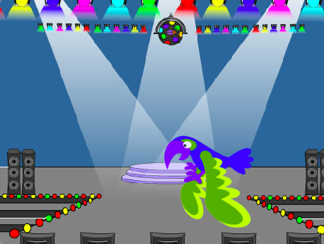

## Du kommer skapa

Skapa ett spel där du måste hitta en dold insekt🐞 på varje nivå. Spelet kommer att ha "start" och "slut" skärmbakgrunder och en timer ⌚ för att visa spelaren hur snabbt de hittade felen.

Du kommer:
+ Skapa nivåer för ditt spel med `nästa bakgrund`{:class="block3looks"}- och `när bakgrunden växlar till`{:class="block3events"}block
+ Använd en `för alltid`{:class="block3control"}-loop för att fortsätta köra kodblock
+ Använd `timer`{:class="block3sensing"} **variabeln** för att berätta för spelaren hur snabbt de hittade insekterna

--- no-print ---
--- task --- 
### Spela ▶️

  
Klicka på insekten för att starta spelet.

Försök att hitta insekten på varje nivå.

Hur väl är insekterna gömda? Du kommer få lägga till dina egna nivåer och göra det så enkelt eller svårt som du vill.

  <iframe allowtransparency="true" width="485" height="402" src="https://scratch.mit.edu/projects/embed/827205162/?autostart=false" frameborder="0"></iframe>

--- /task ---

--- /no-print ---

--- print-only ---

--- /print-only ---

Mer än 2,5 miljarder människor spelar datorspel varje år. Tänk bara på hur många människor som är inblandade i att skapa dessa spel. Vill du jobba med att designa, koda eller testa spel för andra att spela? 

