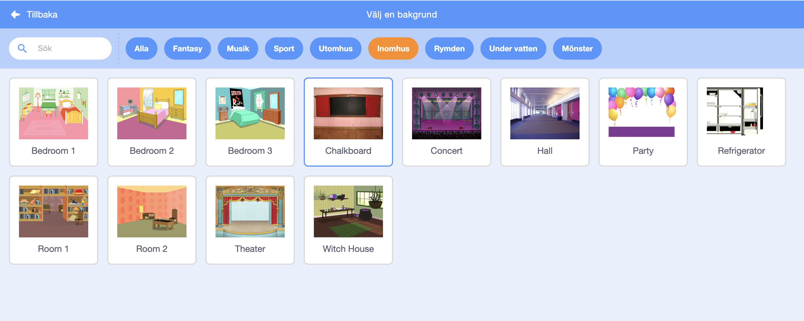
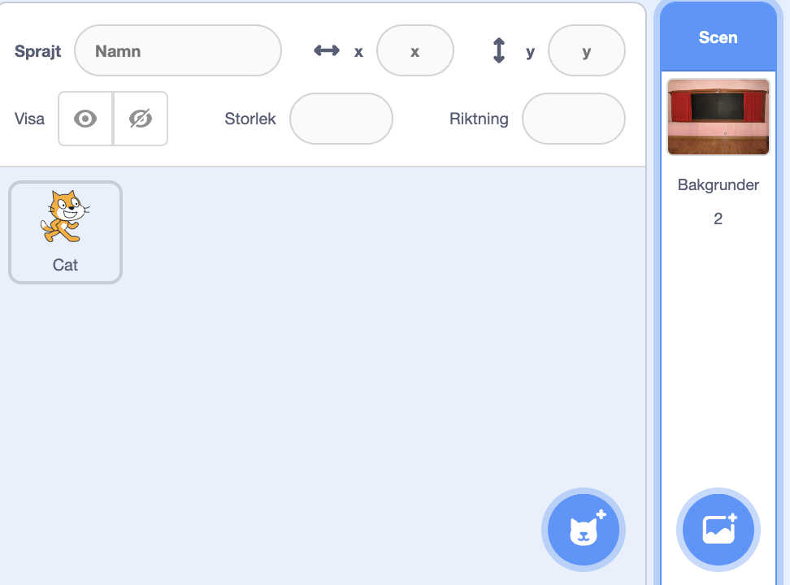
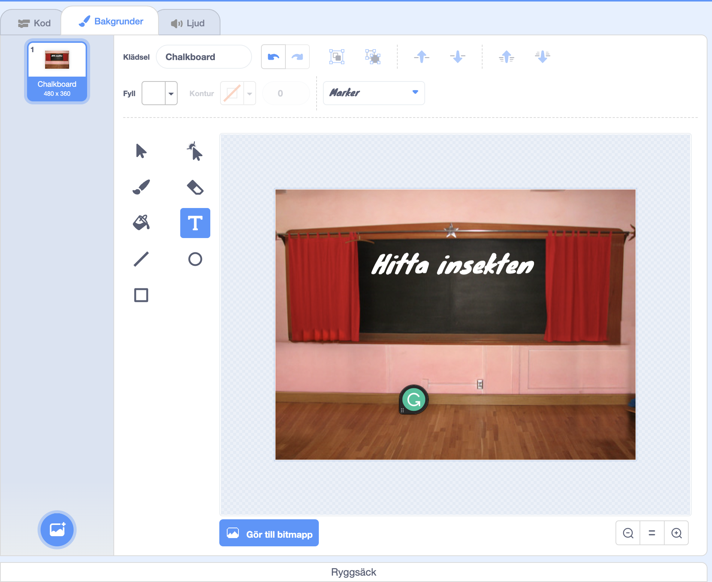

## Startskärm

Ge ditt spel en startskärm.

{:width="300px"}

### Öppna startprojektet

--- task ---

Öppna [Hitta insekten startprojektet](https://scratch.mit.edu/projects/582214723/editor){:target="_blank"}. Scratch kommer öppnas i en annan flik i webbläsaren.

[[[working-offline]]]

--- /task ---

### Lägg till en bakgrund

--- task ---

Lägg till bakgrunden **Griffeltavla** från kategorin **Inomhus**.

--- /task ---

**Scenen** har en **Bakgrunder** flik istället för en **klädslar** flik. Det är här du kan skapa bilder för **Scenen**.

--- task ---

Klicka på scenfönstret.

--- /task ---

### Redigera bakgrunden

--- task ---

Klicka på fliken **Bakgrunder** för att öppna färgredigeraren.

--- /task ---

--- task ---

Välj **bakgrund1** och klicka på **radera**ikonen för att ta bort bakgrunden **bakgrund1** från ditt projekt. Du behöver inte **bakgrund1** i det här projektet.

--- /task ---

Bakgrunden **griffeltavla** kommer nu att markeras.

--- task ---

Klicka på **Konvertera till vektor**. Nu kommer du att kunna lägga till text som du kan flytta runt.

--- /task ---

--- task ---

Använd **Text**verktyget för att lägga till texten `Hitta insekten` på griffeltavlan:

Vi använde typsnittet **Marker** i vitt, men **välj** typsnittet och färgen du vill använda.

**Tips:** Byt till verktyget **Välj** (pil) för att flytta runt din text. För att ändra storleken på texten, ta tag i hörnet av texten och dra.

--- /task ---

## Byt namn på bakgrunden

--- task ---

Ändra namnet på bakgrunden till `start` eftersom du kommer att behöva välja den senare i projektet.

**Tips:** Om du använder tydliga namn blir det lättare att förstå ditt projekt, särskilt när du kommer tillbaka till det senare.

--- /task ---

### Lägg till insektssprajt

--- task ---

Ta bort **Scratchkatt**sprajten.

--- /task ---

--- task ---

Klicka på **Välj en sprajt** och skriv `insekt` i sökrutan.

**Välj:** Välj en insekt som spelare ska hitta i ditt spel.

**Tips:** Ge ditt projekt ett namn. Du kanske vill ha med namnet på insekten som du precis har valt.

--- /task ---

Ett fel i ett datorprogram kallas en **bug** (engelska för insekt). Att hitta och ta bort fel i datorprogram kallas att **debugga**. Grace Hopper är en berömd programmerare. Hennes team hittade en gång en nattfjäril i sin dator. Deras anteckningar säger, "Första faktiska fallet av att en bug (insekt) hittas."

