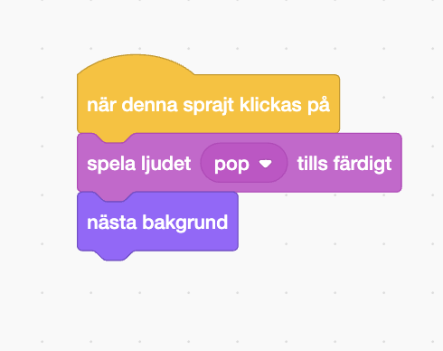

## Första nivån

<div style="display: flex; flex-wrap: wrap">
<div style="flex-basis: 200px; flex-grow: 1; margin-right: 15px;">
Lägg till en ny bakgrund som den första nivån i ditt spel och göm insekten.
</div>
<div>

{:width="300px"}

</div>
</div>

### Lägg till en till bakgrund

--- task ---

Lägg till **Spotlight**bakgrunden från kategorin **Musik**.


--- /task ---

### Ändra storlek på insekten

--- task ---

Klicka på **insekts**sprajten i sprajtlistan. Lägg till kod som ändrar `-storleken`{:class="block3looks"} av din insekt `när bakgrunden växlar till Spotlight`{:class="block3events"}:


```blocks3
when backdrop switches to [Spotlight v]
set size to [20] % // mycket liten
```

--- /task ---

--- task ---

Klicka på koden för att ändra storleken och dra sedan din lilla insekt till ett gömställe.

Lägg till kod för att placera din insekt:


```blocks3
when backdrop switches to [Spotlight v]
set size to [20] % // mycket liten
+ go to x: [13] y: [132] // på discokulan
```

**Välj:** Du kan välja en annan storlek och plats om du föredrar det.

--- /task ---

### Flytta till nästa bakgrund

När du spelar spelet och du lyckats hitta insekten kommer spelet att byta till nästa bakgrund. För att starta spelet kommer du klicka på insekten på startskärmen.

Blocket `nästa bakgrund`{:class="block3looks"} byter till nästa bakgrund i den ordning som bakgrunderna är listade när du klickar på fliken **bakgrunder** för **Scenen**.

--- task ---

Lägg till kod till din **insekts**sprajt som `spelar ett popljud`{:class="block3sound"} och byt till `nästa bakgrund`{:class="block3looks"} `när denna sprajt klickas på`{:class="block3events"}:


```blocks3
when this sprite clicked
play sound [Pop v] until done
next backdrop
```

--- /task ---

### Få spelet att börja med startskärmen

--- task ---

Klicka på Scenrutan och lägg till den här koden till **Scenen**:


```blocks3
when flag clicked
switch backdrop to [start v] // startskärm
```

--- /task ---

--- task ---

**Test:** Klicka på den gröna flaggan för att testa ditt projekt.

Du kommer att märka att på 'start'-skärmen kommer insekten fortfarande att ha inställningarna för att gömma sig på sitt gömställe från den första nivån (i det här exemplet på discokulan).

**Tips:** Efter den sista bakgrunden i listan kommer `nästa bakgrund`{:class="block3looks"} att växla tillbaka till den första bakgrunden.

--- /task ---

--- task ---

Klicka på **insekts**sprajten i sprajtlistan. Lägg till kod för att `ställa in storleken`{:class="block3looks"} på insekten när din `bakgrund växlar till`{:class="block3events"} `start`{:class="block3events"}skärmen:


```blocks3
when backdrop switches to [start v]
set size to [100] % // fullstor
```

--- /task ---

### Ändra insektens position

--- task ---

Försök att placera insekten på "start"-skärmen.

Din kod ändrar bakgrunden när du klickar på insekten! Det är inte bra när du försöker placera insekten.

För att åtgärda problemet måste du stoppa koden från att köras när du klickar på insekten.

--- /task ---

--- task ---

Klicka på den gröna flaggan för att återgå till startskärmen.

Klicka på **insekts**sprajten i Sprajtlistan och dra blocken bort från `när denna sprajten klickas på`{:class="block3events"}-blocket:


--- /task ---

--- task ---

Försök att placera insekten igen. Dra insekten till griffeltavlan under texten:


Lägg till kod för att se till att insekten är placerad på griffeltavlan varje gång din `-bakgrund växlar till`{:class="block3events"} `start`{:class="block3events"}skärmen:


```blocks3
when backdrop switches to [start v]
set size to [100] % // fullstor
+ go to x: [0] y: [30] // på brädan
```

--- /task ---

--- task ---

Sätt ihop blocken igen så att koden är under `när denna sprajt klickas på`{:class="block3events"}-blocket:



--- /task ---

--- task ---

**Test:** Klicka på den gröna flaggan för att testa ditt projekt. Klicka på insekten för att gå till nästa bakgrund. Insekten ska vara stor på "start"-skärmen och liten på "Spotlight"-nivån.

--- collapse ---
---
title: Inget händer när jag klickar på insekten
---

Har du glömt att koppla tillbaka koden till `när denna sprajt klickas på`{:class="block3events"}-blocket?

--- /collapse ---

--- /task ---