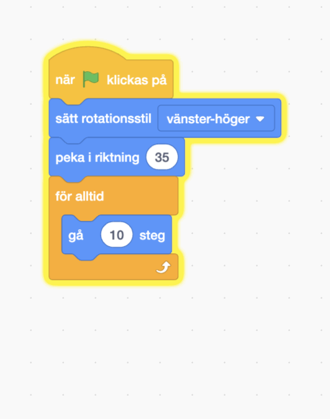

## Papegojastörning

<div style="display: flex; flex-wrap: wrap">
<div style="flex-basis: 200px; flex-grow: 1; margin-right: 15px;">
För att göra det svårare för spelare att hitta och klicka på insekten kommer du lägga till en irriterande papegoja för att distrahera dem. 
</div>
<div>

{:width="300px"}

</div>
</div>

### Lägg till papegojasprajten

--- task ---

Lägg till **Papegoja**sprajten.


--- /task ---

### Animera papegojasprajten

I [Hinn med bussen](https://projects.raspberrypi.org/en/projects/catch-the-bus){:target="_blank"}-projektet använde du en `repetera`{:class="block3control"}loop.

Du kommer att använda en annan loop här. En `för alltid`{:class="block3control"}-loop kör kodblocken inuti den om och om igen. Det är den perfekta loopen för en irriterande papegoja som inte kommer att sluta flyga runt och störa.

--- task ---

Add code to make the parrot flap around in a distracting way. Look at the comments on the code blocks for some different numbers to try:


```blocks3
when flag clicked
set rotation style [left-right v] // do not go upside down
point in direction [35] // number from -180 to 180
forever // keep being annoying
move [10] steps // the number controls the speed
if on edge, bounce // stay on the Stage
next costume // flap
change [color v] effect by [5] // try 11 or 50
wait [0.25] seconds // try 0.1 or 0.5
end
```

--- /task ---

--- task ---

**Test:** Klicka på den gröna flaggan för att testa ditt projekt igen. Kommer du ihåg var du gömde insekten?

I Scratch lyser kod som körs med en gul kontur:



**Tips:** Om papegojan blir för irriterande medan du kodar, kan du klicka på den röda stoppknappen ovanför scenen för att stoppa koden från att köras.

--- /task ---

