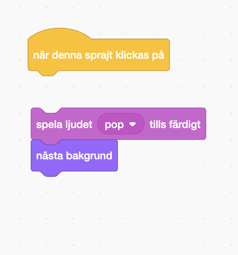
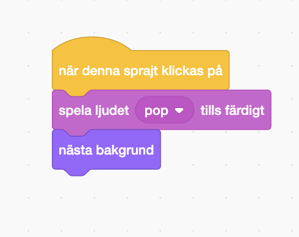

## Andra nivån

<div style="display: flex; flex-wrap: wrap">
<div style="flex-basis: 200px; flex-grow: 1; margin-right: 15px;">
Välj en bakgrund för att skapa en andra nivå till ditt spel och gör insekten svår att hitta. 
</div>
<div>

{:width="300px"}

</div>
</div>

### Lägg till en till bakgrund

--- task ---

**Välj:** Välj en bakgrund för din andra nivå. Vi har valt **stads**bakgrunden, men du kan välja den du gillar mest.


**Tips:** Kom ihåg att bakgrunder med många färger och detaljer kommer att göra insekten svårare att hitta. Hur svårt kommer du att göra ditt spel?

--- /task ---

### Stoppa koden från att köras

--- task ---

Dra blocken bort från `när denna sprajt klickas på`{:class="block3events"}-blocket för att stoppa dem från att köras när du klickar på insekten:



--- /task ---

### Ändra storlek på insekten

--- task ---

Lägg till kod för att `ställa in storlek`{:class="block3looks"} på insekten för den andra nivån:


```blocks3
when backdrop switches to [Urban v] // välj din bakgrund
set size to [20] % // prova en annan storlek 
```

**Test:** Klicka på din nya kod för att köra den.

--- /task ---

### Göm din insekt

--- task ---

Dra din insekt till ett bra gömställe på scenen.


--- /task ---

Lägg din insekt i dess gömställe.

--- task ---

Lägg till ett `gå till x: y:`{:class="block3motion"}-block till din kod:


```blocks3
when backdrop switches to [Urban v]
set size to [20] % // prova en annan storlek 
+ go to x: [24] y: [13] // i skyltfönstret
```

--- /task ---

### Testa din kod

--- task ---

Sätt tillbaka blocken under `när denna sprajt klickas på`{:class="block3events"}-blocket så att när insekten klickas byts bakgrunden till `nästa bakgrund`{:class="block3looks"}:



--- /task ---

--- task ---

**Test:** Klicka på den gröna flaggan för att testa ditt projekt.

--- /task ---

Din insekt kan nu vara framför papegojan.

--- task ---

Lägg till kod som ser till att din insekt alltid är längst `bak`{:class="block3looks"}:


```blocks3
when flag clicked
forever
go to [back v] layer
```

Nu kommer din insekt alltid att stanna längst bak, även om du behöver ändra dess position.

--- /task ---
