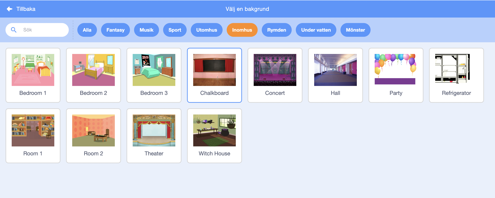
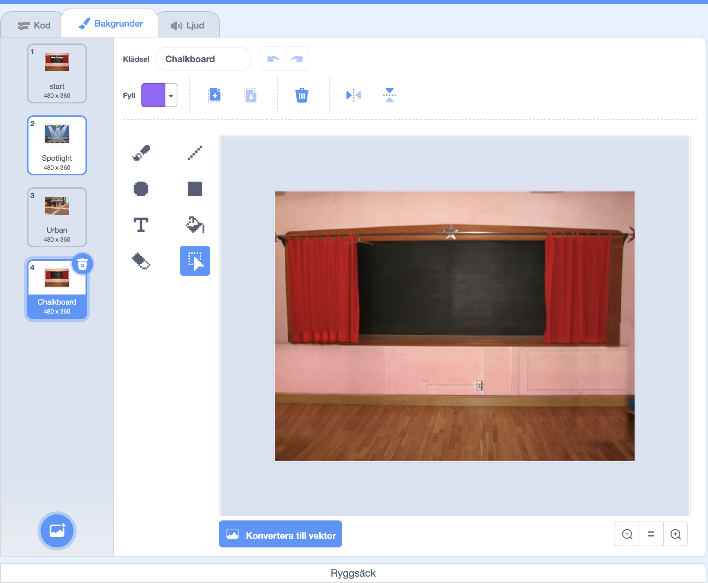
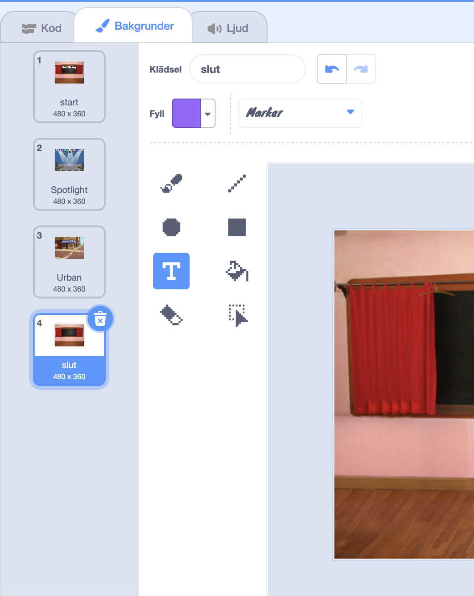
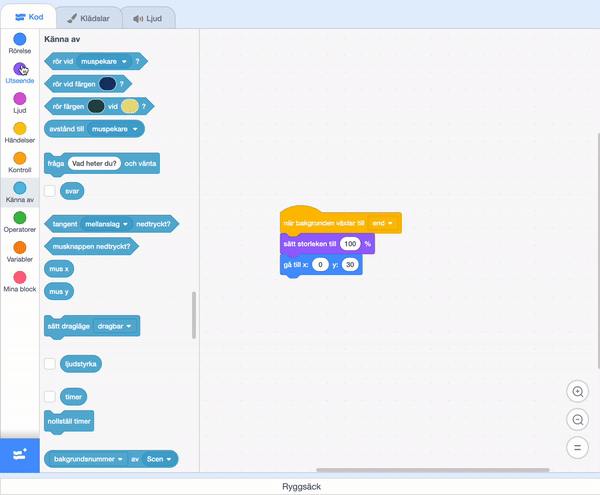

## Slutskärm

<div style="display: flex; flex-wrap: wrap">
<div style="flex-basis: 200px; flex-grow: 1; margin-right: 15px;">
Skapa en "slut"-skärm för att visa hur många sekunder det har tagit spelaren att hitta insekterna. 
</div>
<div>

{:width="300px"}

</div>
</div>

<p style="border-left: solid; border-width:10px; border-color: #0faeb0; background-color: aliceblue; padding: 10px;">
Ibland räcker det inte att bara med att klara av ett spel. Spelare gillar att veta hur de presterade mot andra spelare eller sig själva. Kan du komma på ett spel som visar hur bra det gick för dig?</p>

### Lägg till en till bakgrund

--- task ---

Lägg till bakgrunden **Griffeltavla** från kategorin **Inomhus**.



**Tips:** I Scratch kan du lägga till samma bakgrund mer än en gång.

--- /task ---

### Redigera bakgrunden

--- task ---

Klicka på fliken **Bakgrunder** för att öppna målarredigeraren.



--- /task ---

--- task ---

Ändra namnet på bakgrunden till `slut`:



**Tips:** Du byter namn på bakgrunden till **slut** för att göra det lättare att förstå din kod.

--- /task ---

### Placera insekten

--- task ---

Klicka på **insekts**sprajten och lägg till kod för att placera den på 'slut'-skärmen:


```blocks3
when backdrop switches to [end v]
set size to [100] % // full-sized
go to x: [0] y: [30] // on the board
```

--- /task ---

### Lägg till en timer

Hur lång tid tar det dig att hitta och klicka på insekterna? Scratch har en `timer`{:class="block3sensing"} som du kan använda för att ta reda på det.

--- task ---

`Timer`{:class="block3sensing"}blocket finns i menyn `Känna av`{:class="block3sensing"}-block. Lägg till kod för att få insekten `att säga`{:class="block3looks"} `timern`{:class="block3sensing"} på 'slut'-skärmen:


```blocks3
when backdrop switches to [end v]
set size to [100] % // full-sized
go to x: [0] y: [30] // on the board
+say (timer) // seconds taken
```



--- /task ---

--- task ---

**Test:** Klicka på den gröna flaggan för att testa din förmåga att hitta. Hur lång tid tar det för dig att hitta insekten?

--- /task ---

För att gå tillbaka till 'start'-skärmen, klicka på insekten på 'slut'-skärmen.

--- task ---

Lägg till kod för att få insekten att sluta säga `timer`{:class="block3sensing"} när du byter till "start"-skärmen:


```blocks3
when backdrop switches to [start v]
set size to [100] % // full-sized
go to x: [0] y: [30] // on the board
+say [] // say nothing
```

--- /task ---

### Stoppa timern

Om du spelar spelet en andra gång kommer `timern`{:class="block3sensing"} att fortsätta räkna.

--- task ---

Lägg till kod till som `nollställer timern`{:class="block3sensing"} när `-bakgrunden växlar till`{:class="block3events"} den första nivån:


```blocks3
when backdrop switches to [Spotlight v] // first level
set size to [20] % // tiny
go to x: [13] y: [132] // on the disco ball
+reset timer // start the timer
```

--- /task ---

--- task ---

**Test:** Klicka på den gröna flaggan och spela spelet. Timern bör återställas när du klickar på insekten på "start"-skärmen och går till den första nivån. När du klickar på insekten på 'slut'-skärmen bör du återgå till 'start'-skärmen och se att insekten inte säger `timern`{:class="block3sensing"}.

--- /task ---

