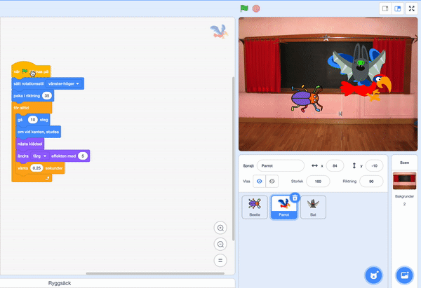

## Uppgradera ditt spel

Om du har tid kan du lägga till fler nivåer och distraktioner till ditt spel. Du kan även ändra sprajten som gömmer sig och texten på griffeltavlan.

--- task ---

Spela ditt spel och se hur snabbt du kan hitta insekterna.

Finns det någon annan som kan prova ditt spel? Hur snabbt kan de hitta insekterna? De kommer inte att veta var du har gömt dem, så det kan ta dem lite längre tid!

Finns det något du vill ändra på?

Du skulle kunna:
- Göra papegojan ännu mer irriterande
- Göra insekterna mindre
- Ändra `färgeffekten`{:class="block3looks"} för att kamouflera insekterna på varje nivå
- Ändra teckensnitt eller färg på texten

--- /task ---

### Lägga till fler nivåer

--- task ---

Här är blocken som du behöver för att dölja insekten på en ny nivå:

```blocks3
when backdrop switches to [new level v]

set size to [20] %

go to x: [0] y: [0] // drag to position the bug first

set [color v] effect to [50]
```

För varje nivå behöver du:
- Lägga till en bakgrund
- Klicka på scenrutan, sedan på fliken **Bakgrunder** och placera den nya bakgrunden före bakgrunden **slut**
- Lägg till ett `när bakgrunden växlar till`{:class="block3events"}-block för den nya bakgrunden och lägg till kod för att placera och gömma insekten

**Tips:** För att dra insekten till ett nytt gömställe måste du "bryta" koden så att bakgrunden inte växlar när du klickar på insekten.

--- /task ---

### Lägga till fler distraktioner

--- task ---

Du kan lägga till fler papegojor eller välja en annan sprajt som fungerar som en distraktion.

Här är koden som du använde för papegojan:

```blocks3
when flag clicked
set rotation style [left-right v] // do not go upside down
point in direction [35] // number from -180 to 180
forever // keep being annoying
move [10] steps // the number controls the speed
if on edge, bounce // stay on the Stage
next costume // flap
change [color v] effect by [5] // try 11 or 50
wait [0.25] seconds // try 0.1 or 0.5
end
```

**Tips:** Du kan dra **Papegoja**sprajtens kod till en annan sprajt för att göra det snabbare att skapa ytterligare en distraktionssprajt.



--- /task ---

--- collapse ---
---
title: Avslutat projekt
---

Du kan se det [avslutade projektet här](https://scratch.mit.edu/projects/486719939/){:target="_blank"}.

--- /collapse ---