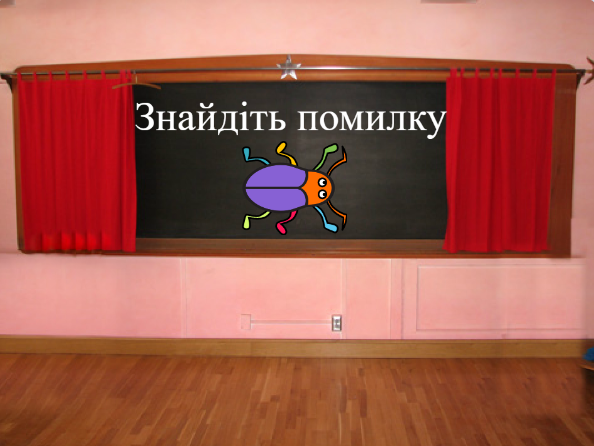
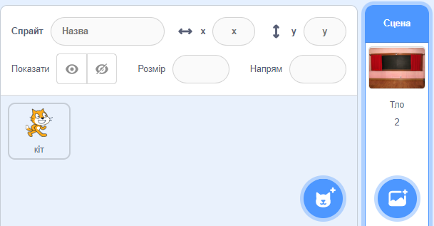
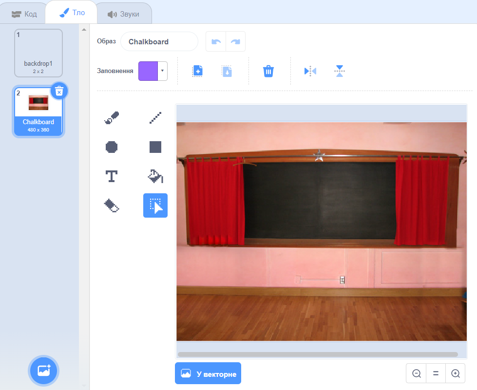
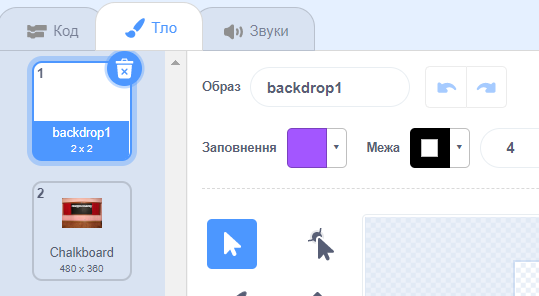
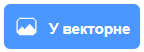
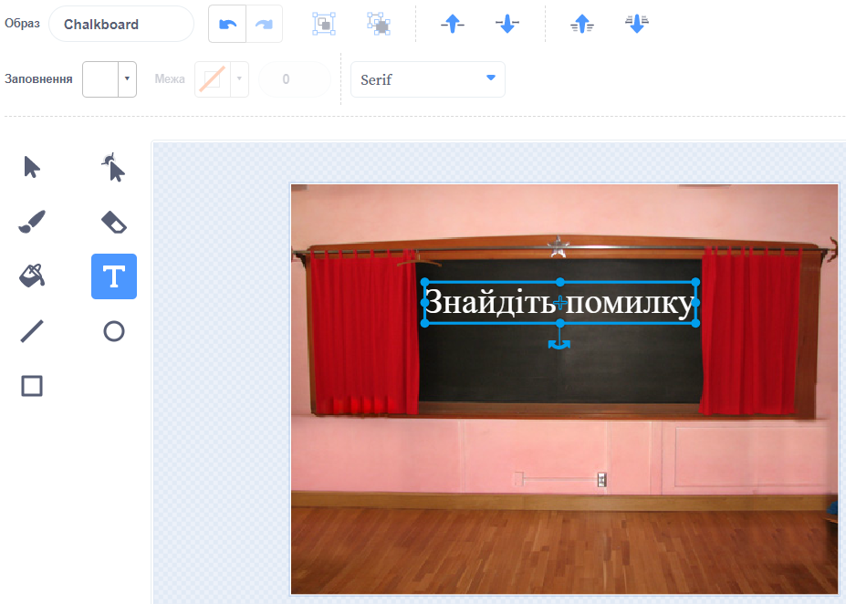
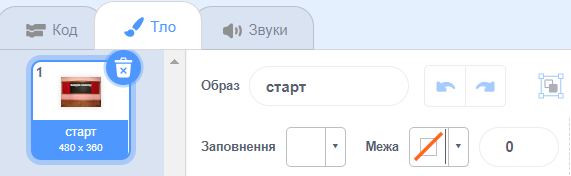
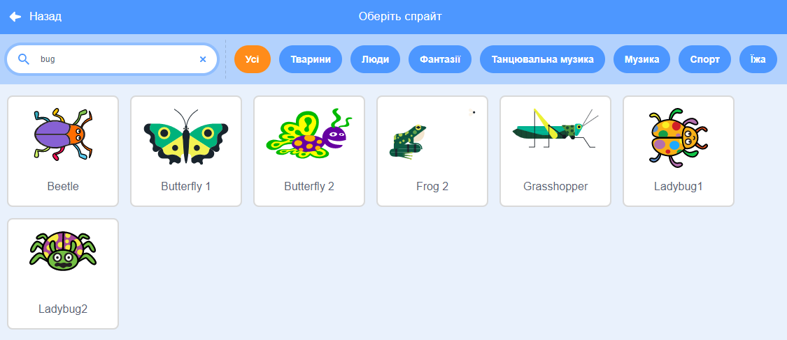

## Стартовий екран

Надай своїй грі 'стартовий' екран.

{:width="300px"}

### Відкрий початковий проєкт

--- task ---

Відкрий [Стартовий проєкт Знайти жучка](https://scratch.mit.edu/projects/582214723/editor){:target="_blank"}. Scratch відкриється в іншій вкладці браузера.

[[[working-offline]]]

--- /task ---

### Додавання тла

--- task ---

Додай тло **Chalkboard** з категорії **У приміщенні**.

--- /task ---

**Сцена** має вкладку **Тло** замість вкладки **Образи**. Тут ти можеш створювати зображення для **Сцени**.

--- task ---

Клацни на панелі Сцени.

--- /task ---

### Редагування тла

--- task ---

Клацни на вкладку **Тло**, щоб відкрити редактор Малювання.

--- /task ---

--- task ---

Вибери **backdrop1** та натисни на іконку **Видалити**, щоб видалити тло **backdrop1** з твого проєкту. Тобі не знадобиться тло **backdrop1** у твоєму проєкті.

--- /task ---

Тло **Chalkboard** буде виділено.

--- task ---

Натисни на **У векторне**. Тепер ти зможеш додавати текст, який можна буде переміщати.

--- /task ---

--- task ---

Скористайся інструментом **Текст**, щоб додати текст `Знайди жучка` на дошку:

Ми використали білий шрифт **Маркера**, але ти можеш **обрати** шрифт і колір, які ти хочеш.

**Порада:** Вибери інструмент **Обрати** (Стрілка), щоб переміщати текст. Щоб змінити розмір тексту, візьмись за кут тексту та перетягни його.

--- /task ---

## Перейменування тла

--- task ---

Зміни назву тла на `старт`, тому що його потім потрібно буде вибирати в проєкті.

**Порада:** Якщо ти використовуєш назви, які мають сенс, тобі буде легше зрозуміти твій проєкт, особливо коли ти повернешся до нього пізніше.

--- /task ---

### Додавання спрайта жучка

--- task ---

Видали спрайт **Scratch Cat**.

--- /task ---

--- task ---

Клацни на **Обрати спрайт** та введи у полі пошуку `bug`.

**Вибір** Обери жучка, якого гравці повинні будуть відшукати у твоїй грі.

**Порада:** Дай назву своєму проєкту. Можливо, ти захочеш включити назву жучка, який щойно був обраний.

--- /task ---

Помилка в комп'ютерній програмі називається **баг**. Пошук і усунення помилок в комп'ютерних програмах називається **налагодження**. Грейс Хоппер - відома інженерка-програміст. Одного разу її команда знайшла метелика у своєму комп'ютері. Вони зазначили: "Перший фактичний випадок виявлення бага."

