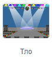
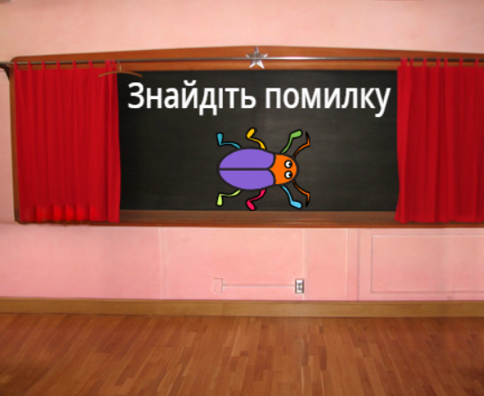

## Перший рівень

<div style="display: flex; flex-wrap: wrap">
<div style="flex-basis: 200px; flex-grow: 1; margin-right: 15px;">
Додай нове тло для першого рівня для твоєї гри, та сховай жучка.
</div>
<div>

{:width="300px"}

</div>
</div>

### Додати ще одне Тло

--- task ---

Додай тло **Spotlight** з категорії **Музика**.


--- /task ---

### Зміна розміру жучка

--- task ---

Клацни на спрайт **жучка** у списку Спрайтів. Додай скрипт, щоб змінити `розмір`{:class="block3looks"} твого жучка, `коли тло зміниться на Spotlight`{:class="block3events"}:


```blocks3
when backdrop switches to [Spotlight v]
set size to [20] % // малесенький
```

--- /task ---

--- task ---

Натисни на код, щоб змінити розмір, а потім перетягни свого маленького жучка в схованку.

Додай код, щоб розмістити свого жучка:


```blocks3
when backdrop switches to [Spotlight v]
set size to [20] % // малесенький
+ go to x: [13] y: [132] // на дискотечній кулі
```

**Вибір:** Ти можеш обрати інший розмір та місце розташування, якщо бажаєш.

--- /task ---

### Перехід до наступного тла

Коли ти граєш у гру та успішно знайдеш жучка, гра перейде на наступне тло. Також, щоб почати гру, потрібно натиснути на жучка на 'стартовому' екрані.

Блок `наступне тло`{:class="block3looks"} здійснює перехід до наступного тла в тому порядку, в якому вони вказані в списку при натисканні на вкладку **Тло** на **Сцени**.

--- task ---

Додай скрипт до твого спрайта **жучка**, щоб `відтворити звук Pop`{:class="block3sound"} та перейти на `наступне тло`{:class="block3looks"} `коли спрайт натиснуто`{:class="block3events"}:


```blocks3
when this sprite clicked
play sound [Pop v] until done
next backdrop
```

--- /task ---

### Зроби так, щоб гра починалася зі Стартового Екрана

--- task ---

Клацни на панелі Сцени та додай цей код до **Сцени**:



```blocks3
when flag clicked
switch backdrop to [старт v] // 'стартовий' екран
```

--- /task ---

--- task ---

**Тест:** Клацни на зелений прапорець, щоб протестувати свій проєкт.

Ти помітиш, що на 'стартовому' екрані жучок все ще матиме налаштування, щоб ховатися у місце з першого рівня (у цьому прикладі - на дискотечній кулі).

**Порада:** Після останнього тла в списку, `наступне тло`{:class="block3looks"} буде змінюватися на перше тло.

--- /task ---

--- task ---

Клацни на спрайт **жучка** у списку Спрайтів. Додай скрипт, щоб `задати розмір`{:class="block3looks"} жучка, коли твоє `тло зміниться на`{:class="block3events"} `стартовий`{:class="block3events"} екран:


```blocks3
when backdrop switches to [старт v]
set size to [100] % // повний розмір
```

--- /task ---

### Зміна позиції жучка

--- task ---

Спробуй розмістити жучок на 'стартовий' екрані.

Твій код змусить фон змінюватися при натисканні на жучка! Це не дуже зручно, коли ти намагаєшся визначити позицію жучка.

Для вирішення цієї проблеми потрібно зупинити виконання коду при натисканні на жучка.

--- /task ---

--- task ---

Клацни на зелений прапорець, щоб повернутися на 'стартовий' екран.

Клацни на спрайт **жучка** у списку Спрайтів та перетягни блоки від блока `коли спрайт натиснуто`{:class="block3events"}:


--- /task ---

--- task ---

Спробуй розташувати жучка ще раз. Перетягни жучка на дошку, під текстом:



Додай код, щоб переконатися, що жучок буде знаходитися на дошці кожен раз, `коли тло зміниться на`{:class="block3events"} `стартовий`{:class="block3events"} екран:


```blocks3
when backdrop switches to [старт v]
set size to [100] % // повний розмір
+ go to x: [0] y: [30] // на дошці
```

--- /task ---

--- task ---

З'єднай блоки назад так, щоб блоки коду знову опинилися під блоком `коли спрайт натиснуто`{:class="block3events"}:


--- /task ---

--- task ---

**Тест:** Клацни на зелений прапорець, щоб протестувати свій проєкт. Натисни на жучка, щоб перейти до наступного тла. Жучок повинен бути великим на 'стартовому' екрані та маленьким на 'рівні Spotlight'.

--- collapse ---
---
title: Коли я натискаю на жучка, нічого не відбувається
---

Ти забув приєднати код назад до блоку `коли спрайт натиснуто`{:class="block3events"}?

--- /collapse ---

--- /task ---