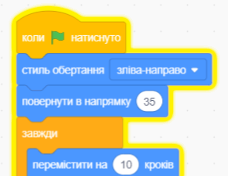

## Відволікання папуги

<div style="display: flex; flex-wrap: wrap">
<div style="flex-basis: 200px; flex-grow: 1; margin-right: 15px;">
Щоб ускладнити гравцям пошук і натискання на жучок, ти можеш додати надокучливого папугу, який буде відвертати їх увагу. 
</div>
<div>

{:width="300px"}

</div>
</div>

### Додавання спрайта Папуги

--- task ---

Додай спрайт **Parrot**.


--- /task ---

### Додай спрайту Папуги анімацію

У проєкті [Встигнути на автобус](https://projects.raspberrypi.org/en/projects/catch-the-bus){:target="_blank"}, ти використовував цикл `чекати`{:class="block3control"}.

Тут ти будеш використовувати інший цикл. Цикл `завжди`{:class="block3control"} запускає блоки коду всередині нього знову і знову. Це ідеальний цикл для надокучливого папуги, який не перестане літати навколо і заважати.

--- task ---

Додай код, щоб папуга махав крилами та відвертав увагу:


```blocks3
when flag clicked
set rotation style [left-right v] // do not go upside down
point in direction [35] // number from -180 to 180
forever // keep being annoying
move [10] steps // the number controls the speed
if on edge, bounce // stay on the Stage
next costume // flap
change [color v] effect by [5] // try 11 or 50
wait [0.25] seconds // try 0.1 or 0.5
end
```

--- /task ---

--- task ---

**Тест:** Натисни на зелений прапорець та протестуй свій проєкт ще раз. Ти пам'ятаєш, куди ти сховав жучок?

У Scratch код, який зараз виконується, підсвічується жовтим контуром:



**Порада:** Якщо папуга починає тебе дратувати під час кодування, ти можеш натиснути червону кнопку Зупинити над сценою, щоб зупинити виконання коду.

--- /task ---

