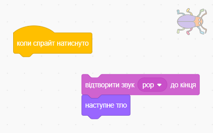
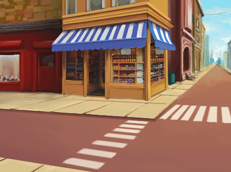
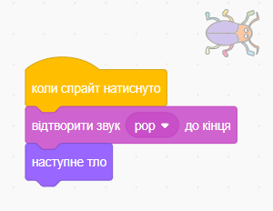

## Другий рівень

<div style="display: flex; flex-wrap: wrap">
<div style="flex-basis: 200px; flex-grow: 1; margin-right: 15px;">
Вибери тло, щоб зробити другий рівень для своєї гри, і зроби так, щоб жучок було складно знайти. 
</div>
<div>

{:width="300px"}

</div>
</div>

### Додай ще одне Тло

--- task ---

**Вибір:** Обери тло для свого другого рівня. Ми обрали тло **Urban**, але ти можеш обрати інше, яке тобі найбільше до вподоби.


**Порада:** Пам'ятай, що на тлі з великою кількістю кольорів і деталей жучка буде складніше знайти. Наскільки складною ти зробиш свою гру?

--- /task ---

### Зупинити виконання коду

--- task ---

Перетягни блоки від блоку `коли спрайт натиснуто`{:class="block3events"}, щоб вони не запускалися при натисканні на жучок:



--- /task ---

### Зміна розміру жучка

--- task ---

Додай код, щоб `задати розмір`{:class="block3looks"} для жучка на другому рівні:


```blocks3
when backdrop switches to [Urban v] // choose your backdrop
set size to [20] % // try another size 
```

**Тест:** Натисни на новий скрипт, щоб запустити його.

--- /task ---

### Приховай свого жучка

--- task ---

Перетягуй жука по Сцені, щоб обрати добре місце для схованки на цьому рівні.



--- /task ---

Помісти свого жучка в його схованку.

--- task ---

Додай блок `перемістити в x: y:`{:class="block3motion"} до твого коду:


```blocks3
when backdrop switches to [Urban v]
set size to [20] % // try another size 
+ go to x: [24] y: [13] // in the shop window
```

--- /task ---

### Протестуй свій код

--- task ---

З'єднай блоки назад до блоку `коли спрайт натиснуто`{:class="block3events"}, щоб при натисканні на жучок тло змінювалося на `наступне тло`{:class="block3looks"}:



--- /task ---

--- task ---

**Тест:** Клацни на зелений прапорець, щоб протестувати свій проєкт.

--- /task ---

Зараз твій жучок може знаходитися перед папугою.

--- task ---

Додай скрипт, щоб переконатися, що жучок завжди знаходиться `позаду`{:class="block3looks"}:


```blocks3
when flag clicked
forever
go to [back v] layer
```

Тепер жучок завжди буде знаходитися позаду, навіть якщо ти будеш змінювати його положення.

--- /task ---
