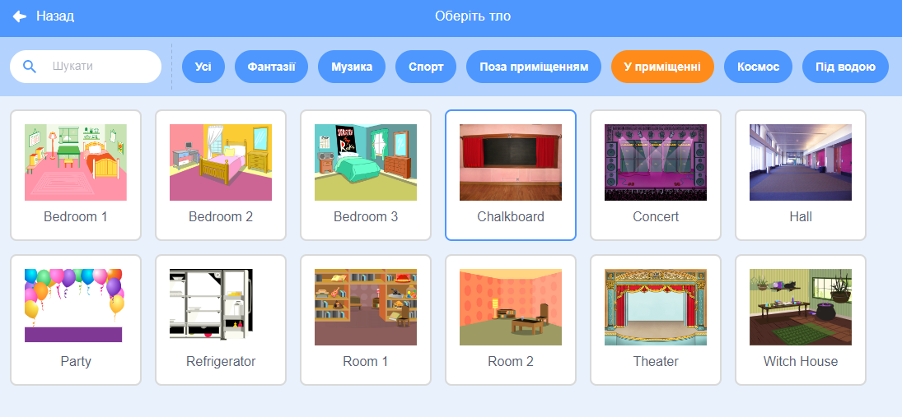

## Кінцевий екран

<div style="display: flex; flex-wrap: wrap">
<div style="flex-basis: 200px; flex-grow: 1; margin-right: 15px;">
Створи 'кінцевий' екран, щоб показати кількість секунд, які гравець витратив на пошук жучків. 
</div>
<div>

{:width="300px"}

</div>
</div>

<p style="border-left: solid; border-width:10px; border-color: #0faeb0; background-color: aliceblue; padding: 10px;">
Часом, просто перемогти у грі недостатньо. Гравці люблять знати, який у них результат та як показали себе інші гравці. Можеш пригадати гру, яка показує, наскільки добре ти себе показав?</p>

### Додай ще одне Тло

--- task ---

Додай тло **Chalkboard** з категорії **У приміщенні**.



**Порада:** У Scratch можна додавати одне й те саме тло більше одного разу.

--- /task ---

### Редагування тла

--- task ---

Клацни на вкладку **Тло**, щоб відкрити редактор Малювання.


--- /task ---

--- task ---

Зміни назву тла на `кінець`:


**Порада:** Ти змінюєш назву фону на **кінець**, щоб зробити твій код простішим для розуміння.

--- /task ---

### Розміщення жучка

--- task ---

Клацни на спрайт **жучка** та додай код для розміщення жучка на 'кінцевому' екрані:


```blocks3
when backdrop switches to [кінець v]
set size to [100] % // повний розмір
go to x: [0] y: [30] // на дошці
```

--- /task ---

### Додай таймер

Скільки часу потрібно, щоб знайти та натиснути на жучка? Scratch має `таймер`{:class="block3sensing"} який ти можеш використати, щоб дізнатися про це.

--- task ---

Блок `таймер`{:class="block3sensing"} у меню блоків `Датчики`{:class="block3sensing"}. Додай код, щоб змусити жучка `говорити` на 'кінцевому' екрані час, який зафіксував{:class="block3looks"} `таймер`{:class="block3sensing"}:


```blocks3
when backdrop switches to [кінець v]
set size to [100] % // повний розмір
go to x: [0] y: [30] // на дошці
+say (timer) // витрачені секунди
```


--- /task ---

--- task ---

**Тест:** клацни на зелений прапорець, щоб протестувати твої навички пошуку. Скільки часу потрібно, щоб знайти жучка?

--- /task ---

Щоб повернутися до 'стартового' екрану, натисни на жучка на 'кінцевому' екрані.

--- task ---

Додай код, щоб жучок перестав видавати `таймер`{:class="block3sensing"}, коли ти переходиш на 'стартовий' екран:


```blocks3
when backdrop switches to [старт v]
set size to [100] % // повний розмір
go to x: [0] y: [30] // на дошці
+say [] // щоб нічого не говорити
```

--- /task ---

### Зупинка таймера

Якщо ти граєш у гру вдруге, `таймер`{:class="block3sensing"} буде продовжувати рахувати.

--- task ---

Додай код `перезапустити таймер`{:class="block3sensing"} до `коли тло зміниться на`{:class="block3events"} перший рівень:


```blocks3
when backdrop switches to [Spotlight v] // перший рівень
set size to [20] % // малесенький
go to x: [13] y: [132] // на дискотечній кулі
+reset timer // запуск таймера
```

--- /task ---

--- task ---

**Тест:** Натисни на зелений прапорець та грай у гру. Таймер повинен обнулятися, коли ти натискаєш на жучка на 'стартовому' екрані, щоб перейти на перший рівень. Коли ти натискаєш на жучка на 'кінцевому' екрані, повернись на 'стартовий' екран та переконайся, що жучок не каже `таймер`{:class="block3sensing"}.

--- /task ---

