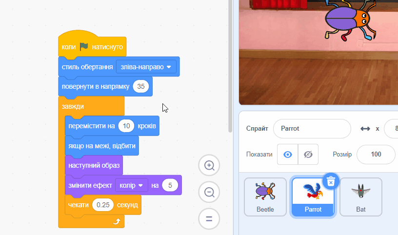

## Покращення своєї гри

Якщо у тебе є час, ти можеш додати більше рівнів і більше відволікаючих факторів у свою гру. Ти також можеш змінити спрайт, який ховається та змінити текст на дошці.

--- task ---

Зіграй у свою гру та перевір, як швидко ти зможеш знайти жучка.

Чи є ще хтось, хто може спробувати твою гру? Як швидко вони можуть знайти жучка? Вони не знатимуть, де ти їх сховав, тому у них це може зайняти трохи більше часу!

Чи є щось, що ти хотів би змінити?

Ти можеш:
- Зроби папугу ще більш надокучливим
- Зробити жучків меншими
- Зміни `ефект колір`{:class="block3looks"} для маскування жучка на кожному рівні
- Зміна шрифту або кольору тексту

--- /task ---

### Додай більше рівнів

--- task ---

Ось блоки, які тобі знадобляться, щоб заховати жучка на новому рівні:

```blocks3
when backdrop switches to [new level v]

set size to [20] %

go to x: [0] y: [0] // drag to position the bug first

set [color v] effect to [50]
```

Для кожного рівня тобі потрібно буде:
- Додай тло
- Натисни на панель Сцени, далі на вкладку **Тло**, потім перетягни нове тло в позицію перед **кінцевим** тлом
- Додай блок `коли тло зміниться на`{:class="block3events"} для нового тла та додай код, щоб змінити позицію та сховати жучка

**Порада:** Щоб перетягнути жучка в нову позицію для хованки, потрібно "зламати" код, щоб тло не змінювалося при натисканні на нього, щоб можна було розташувати жучок на новому рівні.

--- /task ---

### Додай більше відвертаючих увагу факторів

--- task ---

Ти можеш додати більше папуг або вибрати інший спрайт, який буде відвертати увагу.

Ось код, який ти використовував для папуги:

```blocks3
when flag clicked
set rotation style [left-right v] // do not go upside down
point in direction [35] // number from -180 to 180
forever // keep being annoying
move [10] steps // the number controls the speed
if on edge, bounce // stay on the Stage
next costume // flap
change [color v] effect by [5] // try 11 or 50
wait [0.25] seconds // try 0.1 or 0.5
end
```

**Порада:** Ти можеш перетягнути код спрайта **Parrot** до іншого спрайта, щоб прискорити створення іншого спрайта для відвертання уваги.



--- /task ---

--- collapse ---
---
title: Завершений проєкт
---

Ти можеш переглянути [завершений проєкт тут](https://scratch.mit.edu/projects/486719939/){:target="_blank"}.

--- /collapse ---