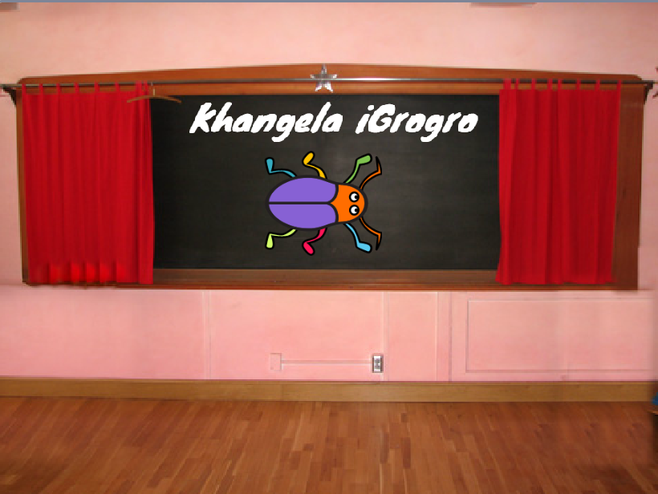
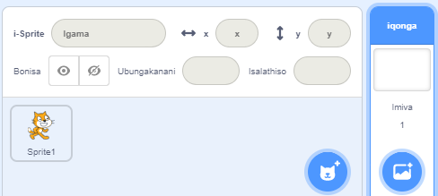
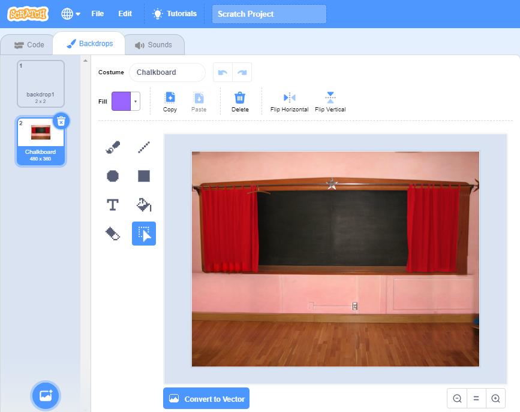
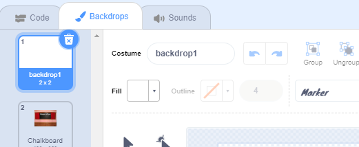
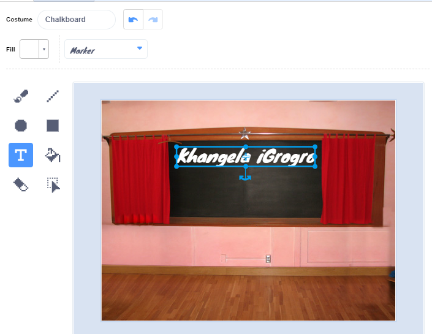
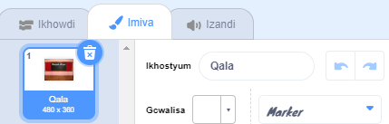
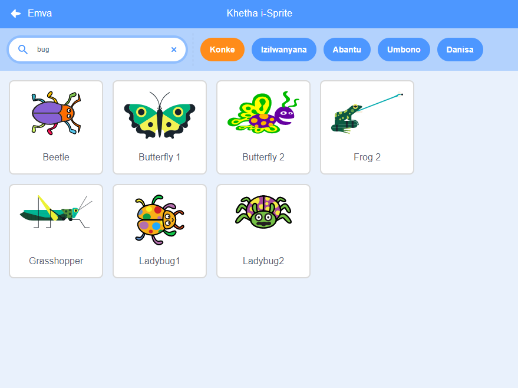

## Iskrini ekuqalwa kuso

Nika umdlalo wakho isikrini 'ekuqalwa kuso'.

{:width="300px"}

### Vula iprojekthi yokuqalisa

--- task ---

Vula iprojekthi [yokuqlisa, khangela igrogro](https://scratch.mit.edu/projects/582214723/editor){:target="_blank"}. uScratch uya kuvula kwenye ithebhu yesikhangeli.

[[[working-offline]]]

--- /task ---

### Yongeza umfanekiso wangemva

--- task ---

Faka  **Ibhodi emnyama** ibengumfunekiso wakho wangasemva isuka kudidi **Ngaphakathi**.

--- /task ---

**Iqonga** lino ** Mfanekiso wangasemva** endaweni yokuba nethebhu yesi **Isinxibo**. Apha kulapho uzoba khona imifanekiso ye **Qonga**.

--- task ---

Cofa kwipayini yeQonga.

--- /task ---

### Hlela umfanekiso wangasemva

--- task ---

Cofa kwithebu  **Mfanekiso wangasemva** ukuvula umhleli wePeyinti.

--- /task ---

--- task ---

Khetha **umfanekiso wangasemva1** kwaye ucofe ku **Cima**  ukususa **umfanekiso wangasemva1** kwiprojekthi yakho. Awumdingi **umfanekiso wangasemva1** kule projekthi.

--- /task ---

Umfanekiso wangasemva **Ibhodi emnyama** uza kuphawulwa ngoku.

--- task ---

Cofa ku **Guqula ibeyi Vector**. Ngoku, ungakwazi ukongeza umbhalo onokuwuhambisela naphina kwiskrini sakho.

--- /task ---

--- task ---

Sebenzisa isixhobo **Umbhalo**  bhala `Khangela igrogro` kwibhodi emnyama:

Sisebenzise ifonti **Phawu**  emhlophe, kodwa **khetha** ifonti enombala ofuna ukuwusebenzisa.

<0>Ingcebiso:</0> Tshintshela kwisixhobo esilu tolo (arrow tool) <0>Khetha</0> sokujikelezisa umbhalo kwakho. Ukutshintsha ubungakanani bombhalo, bamba ikona yombhalo uze uwutsale.

--- /task ---

## Wuthiye ngokutsha umfanekiso wangasemva

--- task ---

Tshintsha igama lomfanekiso wakho wangemva ubengu `umva wokuqala`, kuba kuya kufuneka ubuyele kuwo ekuhambeni kweprojekthi.

**Ingcebiso:** Ukuba usebenzisa amagama anengqiqo, kuya kuba lula ukuyiqonda iprojekthi yakho, ingakumbi emaphethelweni eprojekthi.

--- /task ---

### Faka isprite esiyigrogro

--- task ---

Cima isprite **Ikati kaScratch** .

--- /task ---

--- task ---

Cofa ku **Khetha iSprite** kwaye uchwetheze `bug` kwibhokisi yokukhangela.

<0>Khetha:</0> Khetha igrogro, ezaku khangelwa ngabadlali kumdlalo wokha woku khangela igrogro.

**Ingcebiso:** Nika iprojekthi yakho igama. Ungathanda ungafaka igama legrogro osanda kuyikhetha.

--- /task ---

Impazamo kwinkqubo yekhompyuter ibizwa ngokuba yi **bug**. Ukufumana kunye nokususa iimpazamo kwiinkqubo zekhompyuter kubizwa ngokuba **debugging**. Grace Hopper yinjineli yesoftware edumileyo. Iqela lakhe lakhe labhaqa inundu (ibhabhathane elibhabha ngobusuku) kwikhompyuter yabo. Amanqaku abo athi, "Ityeli lokuqala yokwenyani yokubhaqwa kwebug."

