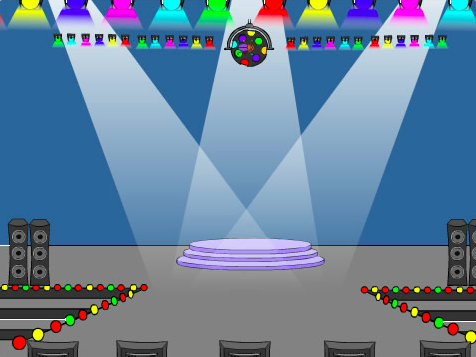
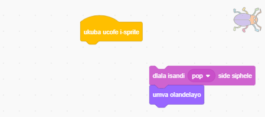

## Inqanaba lokuqala

<div style="display: flex; flex-wrap: wrap">
<div style="flex-basis: 200px; flex-grow: 1; margin-right: 15px;">
Faka umfanekiso wangasemva omtsha kwinqanaba lakho lokuqala, ufihle igrogro.
</div>
<div>

{:width="300px"}

</div>
</div>

### Yongeza umfanekiso wangemva

--- task ---

Faka umfanekiso wangasemva **Ukhanyo** usuka kudidi lo **Mculo**.


--- /task ---

### Lungisa ubungakanani be grogro

--- task ---

Cofa kwisprite **Grogro**  kuluhlu lweSprite. Faka umbhalo ukuze utshintshe `ubukhulu`{:class="block3looks"} begrogro yakho `xa umfanekiso wangasemva etshintshela kuKhanyo`{:class="block3events"}:


```blocks3
when backdrop switches to [Spotlight v]
set size to [20] % // incinci
```

--- /task ---

--- task ---

Cofa kwikhowudi ukuze utshintshe ubukhulu begrogro, emva koko tsala igrorgro yakho encinci uyibeke kwindawo efihlekileyo.

Faka ikhowudi ukubeka igrogroyakho yakho endaweni oyidinga kuyo:


```blocks3
when backdrop switches to [Spotlight v]
set size to [20] % // incinci
+ go to x: [13] y: [132] // kwibhola yedisko 
```

**Khetha:** Ungakhetha ubukhulu obahlukileyo kunye nendawo yokuzimelisa igrogro, ukuba uyathanda.

--- /task ---

### Tshinsha ufake umfanekiso wangemva olandelayo

Xa udlala umdlalo kwaye uyibhaqe igrogro, umdlalo uya kutshintshela kumfanekiso wangemva olandelayo. Okunye, ukuze uqale lo mdlalo, uya kucofa kwigrogro kwisikrini 'sokuqala'.

Iblokhi `umfanekiso wangemva olandelay`{:class="block3looks"} uye utshintshe uye kumfanekiso olandelayo ngoku landelelana kwawo kuluhlu lwemiva kwithebhu **Imifanekiso yangemva** ukwenzela i**Qonga**.

--- task ---

Faka ikhowudi kwisprite **igrogro** ukuze kube ku `dlala isandi esili Qampu`{:class="block3sound"} kwaye kutshintshe `umfanekiso wangemva olandelayo`{:class="block3looks"} `xa esi isprite sicofiwe`{:class="block3events"}:


```blocks3
when this sprite clicked
play sound [Pop v] until done
next backdrop
```

--- /task ---

### Yenza umdlalo uqale ngeSkrini sokuQala

--- task ---

Nqakraza kwisahlulo seqonga kwaye ufake le khowudi kwi **Qonga**:


```blocks3
when flag clicked
switch backdrop to [qala v] // iskrini sokuqala
```

--- /task ---

--- task ---

**Uvavanyo:** Cofa kwiflegi eluhlaza ukuze uvavanye iprojekthi yakho.

Uya kuqaphela ukuba kwiskrini 'sokuqala', igrogro izakuba nezicwangciso zokuzizimela kwindawo ebizinyeliswe kuyo ukusuka kwinqanaba lokuqala (kulo mzekelo, kwibhola ye-disco).

**Ingcebiso:** Emva komfanekiso wangasemva wokugqibela kuluhlu, `umfanekiso wangasemva olandelayo`{:class="block3looks"} uzakutshintshela kumfanekiso wangasemva wokuqala.

--- /task ---

--- task ---

Cofa kwisprite **Grogro** kuluhlu lweSprite. Faka umbhalo ku `misala ubungakanani`{:class="block3looks"} begrogro xa `umfanekiso wangasemva utshintshela` kwiskrini soku`qala`:


```blocks3
when backdrop switches to [start v]
set size to [100] % // ubungakanani obupheleleyo
```

--- /task ---

### Tshintsha indawo igrogro ekuyo

--- task ---

Zama ukumisa igrogro kwisikrini 'sokuqala'.

Ikhowudi yakho iya kwenza utshintsho kumfanekiso wangasemva xa ucofa kwigrogro! Lonto ayiloncedo xa uzama ukumisa igrogro.

Ukulungisa le ngxaki, kufuneka ikhowudi iyeke ukusebenzeni xa ucofa kwigrogro.

--- /task ---

--- task ---

Cofa kwiflegi eluhlaza ukubuyela kwiscreen 'sokuqala'.

Cofa kwisprite `igrogro` kuluhlu lweSprite kwaye utsala iibhloko isuke kwibhloko u `xa le sprite icofa`{:class="block3events"}:



--- /task ---

--- task ---

Zama utsala igrogro ukuze uyibeke kwindawo kwakhona. Tsala igrogro uyibeke ebhodini emnyama, ngaphantsi kombhalo:


Faka ikhowudi ezakuqinisekisa ukuba rhoqo xa `umfanekiso wangasemva etshinstela`{:class="block3events"}  kwiskrini soku`qala`{:class="block3events"} izakuba sebhodini  emnyama igrogro:


```blocks3
when backdrop switches to [qala v]
set size to [100] % // ubungakanani obupheleleyo
+ go to x: [0] y: [30] // ebhodini
```

--- /task ---

--- task ---

Dibanisa iiblokho zekhowudi ukuze zonke zibengaphantsi kuka `xa esisprite sicofiwe`{:class="block3events"} kwakhona:


--- /task ---

--- task ---

**Uvavanyo:** Cofa kwiflegi eluhlaza ukuze uvavanye iprojekthi yakho. Cofa kwigrogro ukuya kumfanekiso wangasemva olandelayo. Igrogro kumele ibe nkulu kwiskrini 'sokuqala' kwaye ibencinci kwinqanaba 'Ukhanyo'.

--- collapse ---
---
isihloko: Akukho nto yenzekayo xa ndicofa igrogro
---

Ulibele ukudibanisa ikhowudi kwibhloko `xa le sprite icofa`{:class="block3events"}?

--- /collapse ---

--- /task ---