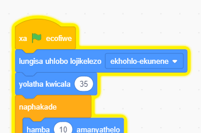

## IsiKhwenene esiphazamisayo

<div style="display: flex; flex-wrap: wrap">
<div style="flex-basis: 200px; flex-grow: 1; margin-right: 15px;">
Ukwenza kube nzima ukubhaqa igrogro kubadlali kunye nokoyicofa, uya kufaka isikhwenene esidikayo kuze baphazamiseke. 
</div>
<div>

{:width="300px"}

</div>
</div>

### Faka isprite IsiKhwenene

--- task ---

Faka isprite [Isikhwenene](https://projects.raspberrypi.org/en/projects/catch-the-bus).


--- /task ---

### Yenza isprite Isikhwenene sibe ngupopayi

Kwiprojekthi <0>Leqa ibhasi</0>{:target="_blank"}, usebenzise iluphu <1>phinda</1>{:class="block3control"} .

Uya kusebenzisa iluphu eyahlukileyo apha. Iluphu `ngonaphakade`{:class="block3control"} iqhuba iibhloko zekhowudi engaphakathi kuyo kwakhona kwaye kwakhona. Yeyona luphu ifanele isikhwenene esidikayo esingayekiyo ukubhabha sijikeleze kwaye singene endleleni.

--- task ---

Yongeza ikhowudi ukwenza isikhwenene siphakuzele sijikeleze ngendlela ephazamisayo. Jonga izimvo kwiibhloko zekhowudi ujonge amanani athile ahlukeneyo uwazame:


```blocks3
when flag clicked
set rotation style [left-right v] // do not go upside down
point in direction [35] // number from -180 to 180
forever // keep being annoying
move [10] steps // the number controls the speed
if on edge, bounce // stay on the Stage
next costume // flap
change [color v] effect by [5] // try 11 or 50
wait [0.25] seconds // try 0.1 or 0.5
end
```

--- /task ---

--- task ---

**Uvavanyo:** Cofa kwiflegi eluhlaza ukuze uvavanye iprojekthi yakho kwakhona. Ngaba uyakhumbula ukuba uyifihle phi igrogro yakho?

KuScratch, ikhowudi esebenzayo iyakhazimla ngolwandlalo olutyheli:



**Ingcebiso:** Ukuba isikhwenene sidika kakhulu ngelixa ukhowudayo, ungcofa iqhosha elibomvu ngaphezulu kweQonga lokumisa ukumisa ikhowudi engasebenzi.

--- /task ---

