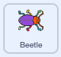
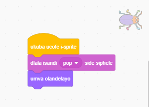

## Inqanaba lesibini

<div style="display: flex; flex-wrap: wrap">
<div style="flex-basis: 200px; flex-grow: 1; margin-right: 15px;">
Khetha umfanekiso wangasemva ukwenza inqanaba lesibini lomdlalo wakho, kwaye wenze kube nzima ukukhangela igrogro. 
</div>
<div>

{:width="300px"}

</div>
</div>

### Yongeza omnye umfanekiso wangemva

--- task ---

**Khetha:** Khetha umfanekiso wangasemva wenqanaba lakho lesibini. Sikhethe umfanekilso wangasemva oyi-**Dolophu** , kodwa ungakhetha oyena uwuthanda kakhulu.


**Ingcebiso:** Khumbula ukuba umfanekiso wangasemva onemibala emininzi kunye neenkcukacha uyakwenza ukuba kubenzima ukuyibhaqa igrogro. Uya kuwenza unzima kangakanani nah umdlalo wakho?

--- /task ---

### Misa ikhowudi yakho ingasebenzi

--- task ---

Tsala iibhloko zakho zekhowudi kude kuno`xa isprite sicofiwe `{:class="block3events"} ukuze ikhowudi inasebenzeni xa ucofa kwigrogro:


--- /task ---

### Lungisa ubukhulu be grogro

--- task ---

Faka ikhowudi ukuze `lungisa ubukhulu`{:class="block3looks"} begrogro yenqanaba lesibini:



```blocks3
when backdrop switches to [Urban v] // choose your backdrop
set size to [20] % // try another size 
```

<0>Uvavanyo:</0> Cofa kwikhowudi yakho entsha ukuze idlale.

--- /task ---

### Fihla igrogro yakho

--- task ---

Tsalela igrogro yakho eQongeni uyise kwindawo elungileyo yokuyoifihla kweli nqanaba.


--- /task ---

Beka igrogro yakho kwindawo yayo yokuzimela.

--- task ---

Yongeza ibhloko ka `yiya ku-x: y:`{:class="block3motion"}:


```blocks3
when backdrop switches to [Urban v]
set size to [20] % // try another size 
+ go to x: [24] y: [13] // in the shop window
```

--- /task ---

### Vavanya ikhowudi yakho

--- task ---

Dibanisa iibhloko zekhowudi `xa isprite sicofiwe`{:class="block3events"} ukuze xa igrogro icofwa, umfanekiso wangasemva itshintshela ku- `umfanekiso olandelayo`{:class="block3looks"}:



--- /task ---

--- task ---

**Uvavanyo:** Cofa kwiflegi eluhlaza ukuze uvavanye iprojekthi yakho.

--- /task ---

Igrogro yakho ingaba phambi kwesikhwenene ngoku.

--- task ---

Yongeza ikhowudi ukuqinisekisa ukuba igrorgro yakho isoloko inga `ngasemva`{:class="block3looks"}:


```blocks3
when flag clicked
forever
go to [back v] layer
```

Ngoku, igrogro yakho iyakuhlala ihleli ngasemva, nokuba ufuna ukutshintsha indawo yayo.

--- /task ---
