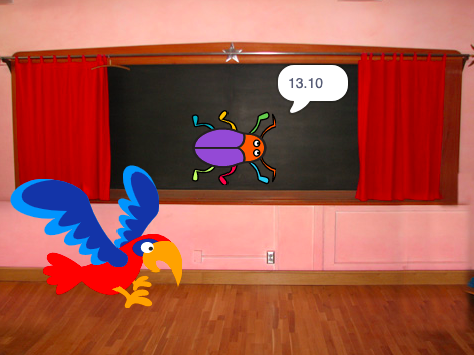

## Isikrini sokugqibela

<div style="display: flex; flex-wrap: wrap">
<div style="flex-basis: 200px; flex-grow: 1; margin-right: 15px;">
Yenza isikrini 'sokugqibela' ukubonisa inani lemizuzwana ethathiweyo ngumdlali ukubhaqa iigrogro. 
</div>
<div>

{:width="300px"}

</div>
</div>

<p style="border-left: solid; border-width:10px; border-color: #0faeb0; background-color: aliceblue; padding: 10px;">
Ngamanye amaxesha, ukuphumelela nje umdlalo akwanelanga. Abadlali bayathanda ukwazi ukuba benze njani, ukuzithelekisa nabanye abadlali okanye bona ngokwabo. Ngaba ungacinga ngomdlalo obonisa ukuba uqhube kakuhle kangakanani?</p>

### Yongeza umfanekiso wangemva

--- task ---

Faka  **Ibhodi emnyama** ibengumfunekiso wakho wangasemva isuka kudidi **Ngaphakathi**.


**Ingcebiso:** KuScratch, unokofaka umfanekiso wangasemva ofanayo uphindaphinde.

--- /task ---

### Hlela umfanekiso wangasemva

--- task ---

Cofa kwithebu  **Mfanekiso wangasemva** ukuvula umhleli wePeynti.


--- /task ---

--- task ---

Tshintsha igama lomqolo ibengu `Isiphelo`:


**Ingcebiso:** Unika igama elitsha kumfanekiso wangasemva ibe ngu**isiphelo** kwenza kubelula ukuqonda ikhowudi yakho.

--- /task ---

### Beka igrogro

--- task ---

Cofa kwisprite **igrogro**  uze ufake ikhowudi yokubeka ibug kwiskrini 'isiphelo':


```blocks3
when backdrop switches to [end v]
set size to [100] % // full-sized
go to x: [0] y: [30] // on the board
```

--- /task ---

### Faka isibali-xesha

Kukuthatha ixesha elingakanani ukubhaqa igrogro? uScratch une `sibali-xesha`{:class="block3sensing"} onokusisebenzisa ukuze wazi.

--- task ---

ibhloko `isibali-xesha`{:class="block3sensing"}  ivela kwi `mvakalelo`{:class="block3sensing"} kwibhloko yemenyu. Faka ikhowudi ezakwenza igrogro `ithi`{:class="block3looks"} `isibali-xesha` kwiskrini sokuqibela.


```blocks3
when backdrop switches to [end v]
set size to [100] % // full-sized
go to x: [0] y: [30] // on the board
+say (timer) // seconds taken
```


--- /task ---

--- task ---

**Uvavanyo:** Cofa kwiflegi eluhlaza ukuvavanya izakhono zakho zokukhangela. Kukuthatha ixesha elingakanani ukubhaqa igrogro?

--- /task ---

Ukubuyela kwiscreen 'sokuqala', cofa kwigrogro kwiscreen 'sokugqibela'.

--- task ---

Faka ikhowudi ezakubangela igrogro iyeke ukuthi `isibali-xesha`


```blocks3
when backdrop switches to [start v]
set size to [100] % // full-sized
go to x: [0] y: [30] // on the board
+say [] // say nothing
```

--- /task ---

### Misa isibali-xesha

Ukuba udlala umdlalo okwesibini, i `isibali-xesha`{:class="block3sensing"} sizakuqubeka sibala.

--- task ---

Faka ikhowudi ukuze  ke`qalele isibali-xesha`{:class="block3sensing"} xa `unfanekiso wangasemva etshintshela`{:class="block3events"} kwinqanaba lokuqala:


```blocks3
when backdrop switches to [Spotlight v] // first level
set size to [20] % // tiny
go to x: [13] y: [132] // on the disco ball
+reset timer // start the timer
```

--- /task ---

--- task ---

**Uvavanyo:** Cofa kwiflegi eluhlaza kwaye udlale umdlalo. Isibali-xesha kumele siqalele xa ucofa igrogro kwiskrini 'sokuqala' ukuze uye kwinqanaba lokuqala. Xa ucofa igrogro kwiscrini 'sokugqibela', kufuneka ubuyele kwskrini 'sokuqala'  ujonge ukuba igrogro ayithi `sibali-xesha`{:class="block3sensing"}.

--- /task ---

