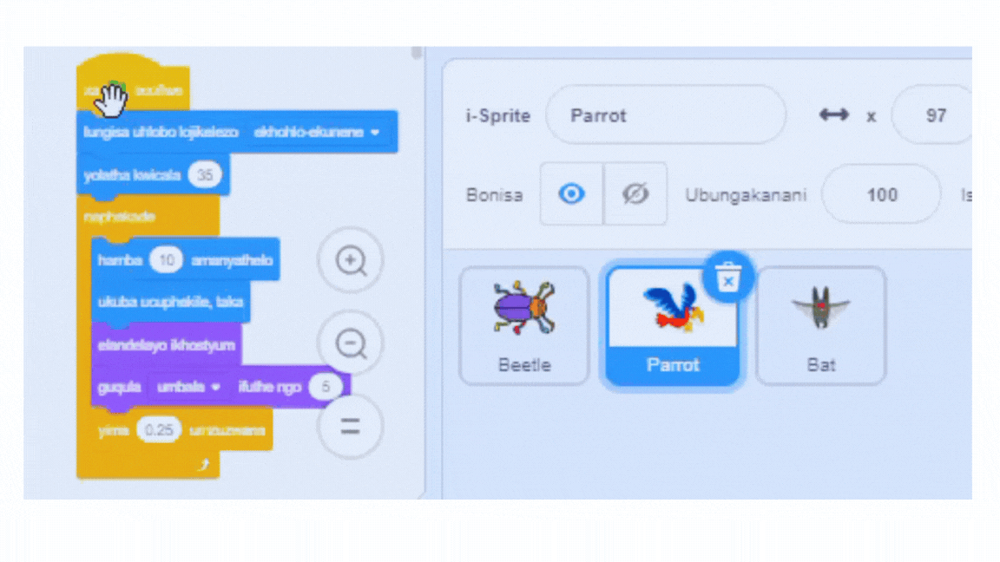

## Phucula umdlalo wakho

Ukuba unexesha, unokongeza amanqanaba amaninzi kunye nezinye iziphazamiso kumdlalo wakho. Uthanda ungasitshintsha i-sprite efihliweyo kwaye utshintshe nokubhaliweyo ebhodini.

--- task ---

Dlala umdlalo wakho ujonge ukuba ungazifumana ngokukhawuleza kangakanani iigrogro.

Ingaba ukhona omnye umntu onokuzama umdlalo wakho? Bangazibhaqa ngokukhawuleza kangakanani iigrogro? Abazukwazi apho uzifihle khona, kusenokubathatha ixesha elide!

Ingaba ikhona into ofuna ukuyitshintsha?

Unga:
- Yenza isikhwenene sidike ngakumbi
- Yenza iigrogro zibe zincinci ngakumbi
- Tshintsha `isiphuma sombala`{:class="block3looks"} ukufihla igrogro kwinqanaba ngalinye
- Tshintsha ifonti okanye umbala wokubhaliweyo

--- /task ---

### Yongeza amanye amanqanaba

--- task ---

Nazi iibhloko ozakuzidinga ukufihla igrogro kwinqanaba elitsha:

```blocks3
when backdrop switches to [new level v]

set size to [20] %

go to x: [0] y: [0] // drag to position the bug first

set [color v] effect to [50]
```

Kwinqanaba ngalinye, kuya kufuneka:
- Yongeza umfanekiso wangemva
- Cofa kuluhlu lweqonga, emva koko kwithebhu **umfanekiso wangasemva**, emva koko tsala umfanekiso wangasemva omtsha uwubeke phambi komfanekiso wangasemva u-**isiphelo**
- Faka ibhloko `xa umfanekiso wasemva utshintshela`{:class="block3events"} ukuze uthsintshe umva kwaye ufake ikhowudi kwindawo yayo kufihleke igrogro

**Ingcebiso:** Ukutsalala igrogro yakho kwindawo entsha yokufihla, uzakufuna 'ukwaphula' ikhowudi ukuze umfanekiso ongasemva ungatshintshi xa ucofa kwigrogri ukuyimisa kwindawo yokuyifihla kwinqanaba elitsha.

--- /task ---

### Yongeza ezinye iziphazamiso

--- task ---

Unokongeza ezinye izikhwenene okanye ukhethe esienye isprite ukuba isebenze njenge siphazamisi.

Nantsi ikhowudi oyisebenzise kwisikhwenene:

```blocks3
when flag clicked
set rotation style [left-right v] // do not go upside down
point in direction [35] // number from -180 to 180
forever // keep being annoying
move [10] steps // the number controls the speed
if on edge, bounce // stay on the Stage
next costume // flap
change [color v] effect by [5] // try 11 or 50
wait [0.25] seconds // try 0.1 or 0.5
end
```

[Ingcebiso:](https://scratch.mit.edu/projects/486719939/) Ungatsala i <0>Parrot</0> ikhowudi ye-sprite kwenye i-sprite ukuyenza ikhawuleze ukwenza enye i-sprite yokuphazamiseka.



--- /task ---

--- collapse ---
---
isihloko: Iprojekthi egqityiweyo
---

Ungajonga [egqityiweyo iprojekthi apha](https://scratch.mit.edu/projects/486719939/){:tharget="_blank"}.

--- /collapse ---